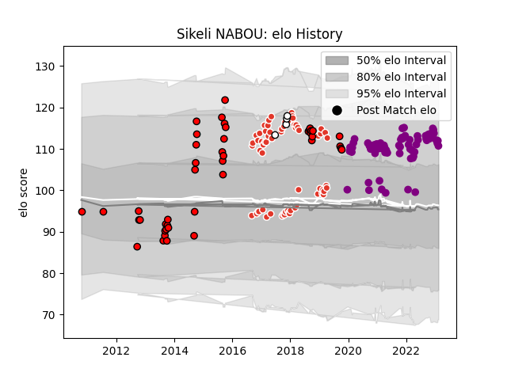

---  
layout: page  
title: Sikeli NABOU  
date: 2023-02-08 11:10:17.404385  
categories: player  
---
# Sikeli NABOU

## Positions: L, FL

## Country: Fiji

## Current elo: 112.0

## Current Percentile: 82.0

# Elo History

# Match History

| Team               |   Appearances |   Win Rate |
|:-------------------|--------------:|-----------:|
| Soyaux-Angouleme   |            70 |   0.492857 |
| Biarritz Olympique |            64 |   0.515625 |
| Counties Manukau   |            43 |   0.395349 |
| Fiji               |             4 |   0.5      |

| Opponent                   |   Matches |   Win Rate |
|:---------------------------|----------:|-----------:|
| Vannes                     |         8 |   0.375    |
| Grenoble                   |         7 |   0.285714 |
| Mont-de-Marsan             |         7 |   0.571429 |
| Beziers                    |         7 |   0.714286 |
| Montauban                  |         7 |   0.428571 |
| Nevers                     |         7 |   0.214286 |
| Aurillac                   |         6 |   0.5      |
| Valence Romans Drome Rugby |         6 |   0.75     |
| Colomiers                  |         6 |   0.333333 |
| Oyonnax                    |         6 |   0.333333 |
| Perpignan                  |         6 |   0.333333 |
| Canterbury                 |         5 |   0        |
| Dax                        |         5 |   0.6      |
| Massy                      |         5 |   0.8      |
| Soyaux-Angouleme           |         5 |   0.6      |
| Auckland                   |         5 |   0.2      |
| Rouen                      |         5 |   0.2      |
| Provence Rugby             |         4 |   0.25     |
| Hawke's Bay                |         4 |   0.5      |
| Southland                  |         4 |   0.75     |
| Tasman                     |         4 |   0.5      |
| Agen                       |         4 |   0.5      |
| Wellington                 |         4 |   0.25     |
| Carcassonne                |         4 |   0.375    |
| Bourgoin-Jallieu           |         4 |   1        |
| Biarritz Olympique         |         4 |   0        |
| Waikato                    |         3 |   0.666667 |
| Bay of Plenty              |         3 |   0.333333 |
| Northland                  |         3 |   0.666667 |
| Albi                       |         3 |   1        |
| Bayonne                    |         3 |   1        |
| Manawatu                   |         3 |   0.333333 |
| Cognac Saint Jean d'Angély |         2 |   1        |
| Nice                       |         2 |   0.5      |
| Blagnac                    |         2 |   1        |
| Taranaki                   |         2 |   0.5      |
| Suresnes                   |         2 |   1        |
| North Harbour              |         2 |   0        |
| Aubenas                    |         1 |   1        |
| US Bressane                |         1 |   0        |
| Ireland                    |         1 |   0        |
| Scotland                   |         1 |   1        |
| Roval Drome XV             |         1 |   1        |
| Italy                      |         1 |   0        |
| Canada                     |         1 |   1        |
| Otago                      |         1 |   1        |
| Chambery                   |         1 |   0        |
| Narbonne                   |         1 |   0        |
| Dijon                      |         1 |   1        |
| Brive                      |         1 |   0        |