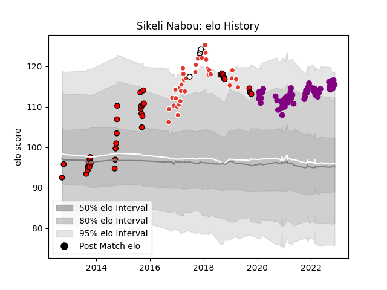

---  
layout: page  
title: Sikeli Nabou  
date: 2022-11-22 11:47:00.245474  
categories: player  
---
# Sikeli Nabou

## Positions: L, FL

## Country: Fiji

## Current elo: 115.0

## Current Percentile: 93.0

# Elo History

# Match History

| Team               |   Appearances |   Win Rate |
|:-------------------|--------------:|-----------:|
| Soyaux-Angouleme   |            53 |   0.518868 |
| Counties Manukau   |            39 |   0.410256 |
| Biarritz Olympique |            36 |   0.5      |
| Fiji               |             4 |   0.5      |

| Opponent                   |   Matches |   Win Rate |
|:---------------------------|----------:|-----------:|
| Mont-de-Marsan             |         6 |   0.5      |
| Nevers                     |         6 |   0.25     |
| Grenoble                   |         6 |   0.333333 |
| Auckland                   |         5 |   0.2      |
| Beziers                    |         5 |   0.8      |
| Canterbury                 |         4 |   0        |
| Southland                  |         4 |   0.75     |
| Rouen                      |         4 |   0.25     |
| Perpignan                  |         4 |   0        |
| Montauban                  |         4 |   0.5      |
| Hawke's Bay                |         4 |   0.5      |
| Wellington                 |         4 |   0.25     |
| Aurillac                   |         4 |   0.5      |
| Bourgoin-Jallieu           |         4 |   1        |
| Northland                  |         3 |   0.666667 |
| Tasman                     |         3 |   0.666667 |
| Provence Rugby             |         3 |   0.333333 |
| Biarritz Olympique         |         3 |   0        |
| Soyaux-Angouleme           |         3 |   0.333333 |
| Albi                       |         3 |   1        |
| Manawatu                   |         3 |   0.333333 |
| Valence Romans Drome Rugby |         3 |   0.666667 |
| Vannes                     |         3 |   0.666667 |
| Waikato                    |         3 |   0.666667 |
| Dax                        |         3 |   0.666667 |
| Colomiers                  |         3 |   0.333333 |
| Oyonnax                    |         3 |   0.333333 |
| Bayonne                    |         2 |   1        |
| Taranaki                   |         2 |   0.5      |
| Suresnes                   |         2 |   1        |
| Bay of Plenty              |         2 |   0.5      |
| Agen                       |         2 |   0.5      |
| Cognac Saint Jean d'Angély |         2 |   1        |
| North Harbour              |         2 |   0        |
| Nice                       |         2 |   0.5      |
| Blagnac                    |         2 |   1        |
| Massy                      |         2 |   0.5      |
| Roval Drome XV             |         1 |   1        |
| Scotland                   |         1 |   1        |
| Narbonne                   |         1 |   0        |
| Italy                      |         1 |   0        |
| US Bressane                |         1 |   0        |
| Ireland                    |         1 |   0        |
| Canada                     |         1 |   1        |
| Dijon                      |         1 |   1        |
| Chambery                   |         1 |   0        |