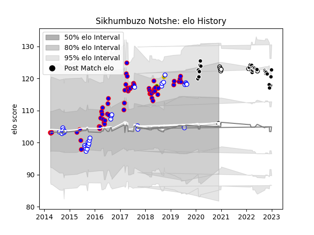

---  
layout: page  
title: Sikhumbuzo Notshe  
date: 2022-12-09 13:05:28.106649  
categories: player  
---
# Sikhumbuzo Notshe

## Positions: N8, FL

## Country: South Africa

## Current elo: 109.0

## Current Percentile: 85.0

# Elo History

# Match History

| Team             |   Appearances |   Win Rate |
|:-----------------|--------------:|-----------:|
| Stormers         |            58 |   0.5      |
| Western Province |            31 |   0.645161 |
| Sharks           |            25 |   0.72     |
| Natal Sharks     |             6 |   0.5      |
| South Africa     |             6 |   0.5      |

| Opponent                 |   Matches |   Win Rate |
|:-------------------------|----------:|-----------:|
| Bulls                    |        10 |   0.5      |
| Lions                    |         8 |   0.375    |
| Free State Cheetahs      |         8 |   0.375    |
| Blue Bulls               |         6 |   0.833333 |
| Golden Lions             |         6 |   0.166667 |
| Jaguares                 |         5 |   0.6      |
| Cheetahs                 |         5 |   1        |
| Sharks                   |         5 |   0.2      |
| Griquas                  |         5 |   0.8      |
| Pumas                    |         4 |   1        |
| Sunwolves                |         4 |   0.625    |
| Chiefs                   |         4 |   0.25     |
| Highlanders              |         4 |   0.5      |
| Queensland Reds          |         4 |   0.75     |
| Natal Sharks             |         3 |   0.666667 |
| New South Wales Waratahs |         3 |   0        |
| Eastern Province Kings   |         3 |   1        |
| England                  |         3 |   0.666667 |
| Melbourne Rebels         |         3 |   1        |
| Crusaders                |         3 |   0.166667 |
| Southern Kings           |         2 |   1        |
| Western Force            |         2 |   1        |
| Western Province         |         2 |   0.5      |
| Hurricanes               |         2 |   0        |
| Zebre                    |         2 |   1        |
| Leinster                 |         2 |   0.5      |
| Dragons                  |         2 |   1        |
| Brumbies                 |         2 |   0.5      |
| Blues                    |         2 |   1        |
| Benetton Treviso         |         1 |   1        |
| New Zealand              |         1 |   0        |
| Ospreys                  |         1 |   1        |
| Glasgow Warriors         |         1 |   1        |
| Edinburgh                |         1 |   0        |
| Scarlets                 |         1 |   1        |
| Connacht                 |         1 |   1        |
| Stormers                 |         1 |   1        |
| Cardiff Blues            |         1 |   0        |
| Ulster                   |         1 |   0        |
| Wales                    |         1 |   0        |
| Australia                |         1 |   1        |