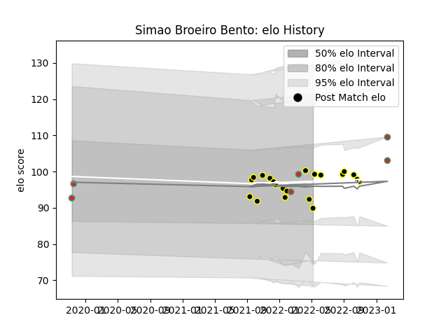

---  
layout: page  
title: Simao Broeiro Bento  
date: 2023-03-21 18:01:06.232189  
categories: player  
---
# Simao Broeiro Bento

Last updated: 2023-03-21
## Positions: FB, W

## Country: Portugal

## Current elo: 89.0

## Current Percentile: 53.0

# Elo History

# Match History

| Team           |   Appearances |   Win Rate |
|:---------------|--------------:|-----------:|
| Mont-de-Marsan |            21 |   0.52381  |
| Portugal       |             9 |   0.555556 |

| Opponent         |   Matches |   Win Rate |
|:-----------------|----------:|-----------:|
| Agen             |         2 |        0.5 |
| Grenoble         |         2 |        0.5 |
| Spain            |         2 |        0.5 |
| Romania          |         2 |        0.5 |
| Poland           |         2 |        1   |
| Nevers           |         2 |        0.5 |
| Aurillac         |         2 |        1   |
| Vannes           |         2 |        0.5 |
| Colomiers        |         2 |        0.5 |
| Beziers          |         2 |        0.5 |
| Georgia          |         1 |        0   |
| Chile            |         1 |        1   |
| Narbonne         |         1 |        1   |
| Carcassonne      |         1 |        1   |
| Oyonnax          |         1 |        0   |
| Brazil           |         1 |        0   |
| Provence Rugby   |         1 |        0   |
| Soyaux-Angouleme |         1 |        1   |
| Bayonne          |         1 |        0   |
| Massy            |         1 |        0   |