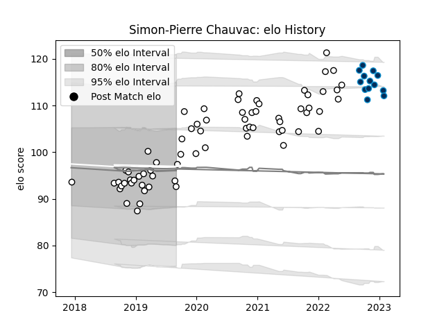

---  
layout: page  
title: Simon-Pierre Chauvac  
date: 2023-01-23 15:30:19.735182  
categories: player  
---
# Simon-Pierre Chauvac

## Positions: P

## Current elo: 93.0

## Current Percentile: 42.0

# Elo History

# Match History

| Team                |   Appearances |   Win Rate |
|:--------------------|--------------:|-----------:|
| Brive               |            68 |   0.522059 |
| Montpellier Herault |            12 |   0.541667 |

| Opponent             |   Matches |   Win Rate |
|:---------------------|----------:|-----------:|
| Pau                  |         6 |   0.666667 |
| Clermont Auvergne    |         5 |   0.4      |
| Racing 92            |         5 |   0.2      |
| Montpellier Herault  |         4 |   0.375    |
| Toulon               |         4 |   0.5      |
| Bordeaux Begles      |         4 |   0.5      |
| Stade Toulousain     |         4 |   0.25     |
| Castres Olympique    |         4 |   0.25     |
| Lyon                 |         4 |   0.5      |
| La Rochelle          |         3 |   0.333333 |
| Perpignan            |         3 |   0.666667 |
| Agen                 |         3 |   0.333333 |
| Biarritz Olympique   |         3 |   0.666667 |
| Bayonne              |         3 |   1        |
| Stade Francais Paris |         3 |   0.666667 |
| Soyaux-Angouleme     |         2 |   1        |
| Nevers               |         2 |   1        |
| Provence Rugby       |         2 |   0.5      |
| Vannes               |         2 |   1        |
| Montauban            |         2 |   0.5      |
| Mont-de-Marsan       |         2 |   0.5      |
| Colomiers            |         2 |   0.5      |
| Carcassonne          |         2 |   0.5      |
| Oyonnax              |         1 |   1        |
| Aurillac             |         1 |   1        |
| London Irish         |         1 |   0.5      |
| Connacht             |         1 |   0        |
| Beziers              |         1 |   0        |
| Massy                |         1 |   1        |