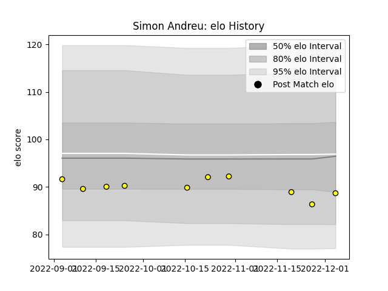

---  
layout: page  
title: Simon Andreu  
date: 2023-03-17 17:20:54.740358  
categories: player  
---
# Simon Andreu

## Positions: C

## Current elo: 101.0

## Current Percentile: 53.0

# Elo History

# Match History

| Team   |   Appearances |   Win Rate |
|:-------|--------------:|-----------:|
| Albi   |            18 |   0.694444 |

| Opponent            |   Matches |   Win Rate |
|:--------------------|----------:|-----------:|
| Blagnac             |         2 |        0.5 |
| Bourgoin-Jallieu    |         2 |        0.5 |
| Carqueiranne-Hyères |         2 |        0.5 |
| Dax                 |         2 |        1   |
| Narbonne            |         2 |        1   |
| Rennes              |         2 |        1   |
| Suresnes            |         2 |        0.5 |
| Chambery            |         1 |        1   |
| Nice                |         1 |        0.5 |
| Tarbes              |         1 |        0   |
| US Bressane         |         1 |        1   |