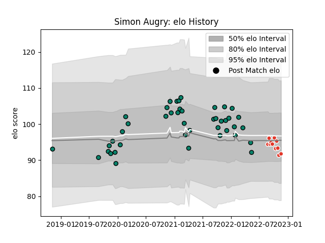

---  
layout: page  
title: Simon Augry  
date: 2022-11-22 11:28:08.524575  
categories: player  
---
# Simon Augry

## Positions: FL

## Current elo: 92.0

## Current Percentile: 31.0

# Elo History

# Match History

| Team               |   Appearances |   Win Rate |
|:-------------------|--------------:|-----------:|
| Montauban          |            43 |   0.5      |
| Biarritz Olympique |            11 |   0.590909 |

| Opponent           |   Matches |   Win Rate |
|:-------------------|----------:|-----------:|
| Vannes             |         5 |   0.2      |
| Rouen              |         4 |   0.5      |
| Carcassonne        |         4 |   0.25     |
| Colomiers          |         4 |   0.5      |
| Nevers             |         4 |   0.625    |
| Oyonnax            |         4 |   0.75     |
| Beziers            |         3 |   0.333333 |
| Biarritz Olympique |         3 |   0.333333 |
| Grenoble           |         3 |   0.5      |
| Mont-de-Marsan     |         3 |   0.666667 |
| Aurillac           |         3 |   1        |
| Perpignan          |         3 |   0.333333 |
| Soyaux-Angouleme   |         2 |   0.75     |
| Narbonne           |         2 |   1        |
| Provence Rugby     |         2 |   0.5      |
| US Bressane        |         1 |   0.5      |
| Agen               |         1 |   0        |
| Massy              |         1 |   1        |
| Bayonne            |         1 |   0        |
| Montauban          |         1 |   1        |