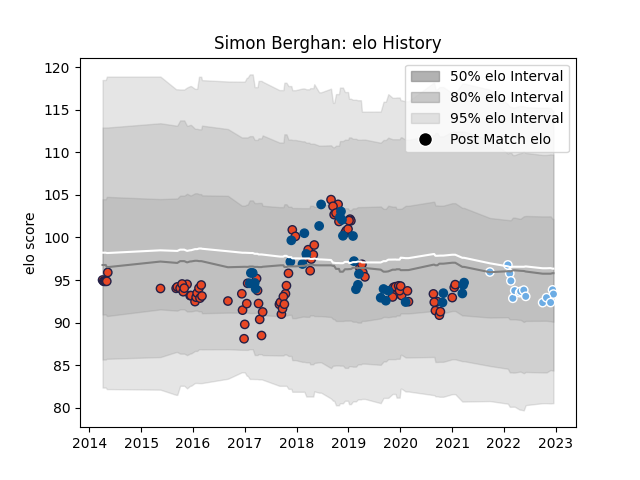

---  
layout: page  
title: Simon Berghan  
date: 2022-12-18 16:31:50.195805  
categories: player  
---
# Simon Berghan

## Positions: P

## Country: Scotland

## Current elo: 93.0

## Current Percentile: 40.0

# Elo History

# Match History

| Team             |   Appearances |   Win Rate |
|:-----------------|--------------:|-----------:|
| Edinburgh        |            93 |   0.543011 |
| Scotland         |            31 |   0.564516 |
| Glasgow Warriors |            15 |   0.466667 |

| Opponent             |   Matches |   Win Rate |
|:---------------------|----------:|-----------:|
| Glasgow Warriors     |        13 |   0.538462 |
| Leinster             |         8 |   0.25     |
| Scarlets             |         7 |   0.428571 |
| Connacht             |         7 |   0.571429 |
| Munster              |         7 |   0.428571 |
| Ospreys              |         6 |   0.333333 |
| Cardiff Blues        |         6 |   0.333333 |
| Zebre                |         6 |   0.5      |
| Benetton Treviso     |         5 |   0.6      |
| Ireland              |         5 |   0.2      |
| Ulster               |         5 |   0.2      |
| France               |         5 |   0.4      |
| Dragons              |         4 |   1        |
| England              |         4 |   0.375    |
| Wales                |         4 |   0.5      |
| Southern Kings       |         3 |   1        |
| London Irish         |         3 |   0.666667 |
| Italy                |         3 |   1        |
| Agen                 |         3 |   1        |
| Bordeaux Begles      |         3 |   0.166667 |
| Georgia              |         2 |   1        |
| Argentina            |         2 |   1        |
| Wasps                |         2 |   1        |
| Edinburgh            |         2 |   0.5      |
| Montpellier Herault  |         2 |   0.5      |
| Toulon               |         2 |   1        |
| Newcastle Falcons    |         2 |   1        |
| Stade Francais Paris |         2 |   0.5      |
| Harlequins           |         1 |   1        |
| South Africa         |         1 |   0        |
| Australia            |         1 |   1        |
| Bath Rugby           |         1 |   1        |
| Timisoara Saracens   |         1 |   1        |
| Stormers             |         1 |   0        |
| Perpignan            |         1 |   1        |
| Bulls                |         1 |   0        |
| Russia               |         1 |   1        |
| Grenoble             |         1 |   0        |
| Canada               |         1 |   1        |
| New Zealand          |         1 |   0        |
| Cheetahs             |         1 |   1        |
| Fiji                 |         1 |   1        |
| La Rochelle          |         1 |   0        |
| Krasny Yar           |         1 |   1        |