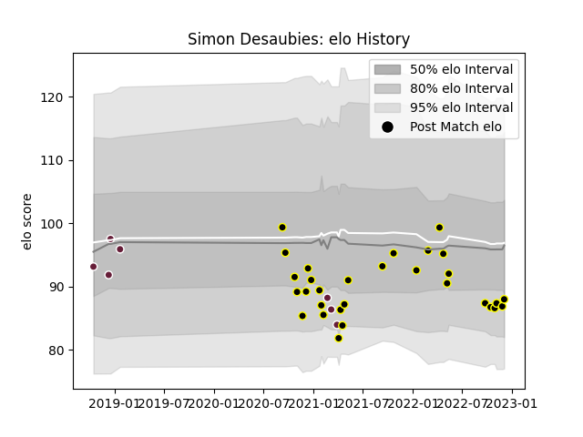

---  
layout: page  
title: Simon Desaubies  
date: 2023-01-13 11:28:08.663968  
categories: player  
---
# Simon Desaubies

## Positions: C, FH

## Current elo: 87.0

## Current Percentile: 24.0

# Elo History

# Match History

| Team            |   Appearances |   Win Rate |
|:----------------|--------------:|-----------:|
| Mont-de-Marsan  |            49 |   0.591837 |
| Bordeaux Begles |             7 |   0.285714 |

| Opponent           |   Matches |   Win Rate |
|:-------------------|----------:|-----------:|
| Nevers             |         5 |   0.4      |
| Aurillac           |         5 |   0.8      |
| Vannes             |         4 |   0.5      |
| Rouen              |         4 |   0.75     |
| Colomiers          |         4 |   0.5      |
| Montauban          |         3 |   0.333333 |
| Beziers            |         3 |   1        |
| Oyonnax            |         3 |   0.5      |
| Soyaux-Angouleme   |         2 |   0.5      |
| Sale Sharks        |         2 |   0.5      |
| Perpignan          |         2 |   0        |
| Narbonne           |         2 |   1        |
| Agen               |         2 |   1        |
| Grenoble           |         2 |   0.5      |
| Connacht           |         2 |   0        |
| Carcassonne        |         2 |   0.5      |
| Biarritz Olympique |         2 |   0.75     |
| Bayonne            |         2 |   1        |
| La Rochelle        |         1 |   0        |
| Pau                |         1 |   1        |
| Provence Rugby     |         1 |   0        |
| Brive              |         1 |   0        |
| Massy              |         1 |   0        |