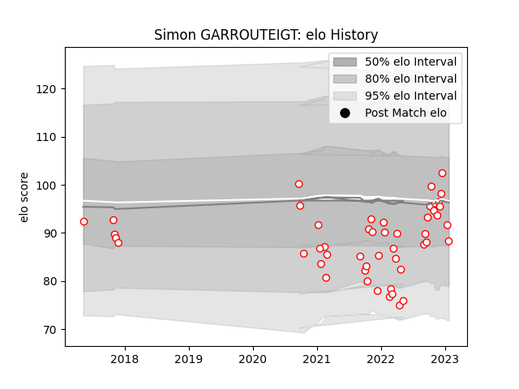

---  
layout: page  
title: Simon GARROUTEIGT  
date: 2023-03-11 00:17:04.359270  
categories: player  
---
# Simon GARROUTEIGT

## Positions: SH

## Current elo: 96.0

## Current Percentile: 27.0

# Elo History

# Match History

| Team   |   Appearances |   Win Rate |
|:-------|--------------:|-----------:|
| Dax    |            53 |   0.528302 |

| Opponent                   |   Matches |   Win Rate |
|:---------------------------|----------:|-----------:|
| Blagnac                    |         5 |   0.2      |
| Tarbes                     |         5 |   0.6      |
| Albi                       |         4 |   0.25     |
| Bourgoin-Jallieu           |         4 |   0.5      |
| Cognac Saint Jean d'Angély |         4 |   0.5      |
| Chambery                   |         3 |   0.666667 |
| Dijon                      |         3 |   0.666667 |
| Narbonne                   |         3 |   0.666667 |
| Nice                       |         3 |   0.666667 |
| Suresnes                   |         3 |   1        |
| Soyaux-Angouleme           |         2 |   0.5      |
| Aurillac                   |         2 |   0.5      |
| Valence Romans Drome Rugby |         2 |   0.5      |
| US Bressane                |         2 |   1        |
| Aubenas                    |         2 |   0.5      |
| Massy                      |         1 |   0        |
| Rennes                     |         1 |   1        |
| Montauban                  |         1 |   0        |
| Carqueiranne-Hyères        |         1 |   1        |
| Beziers                    |         1 |   0        |
| Vannes                     |         1 |   0        |