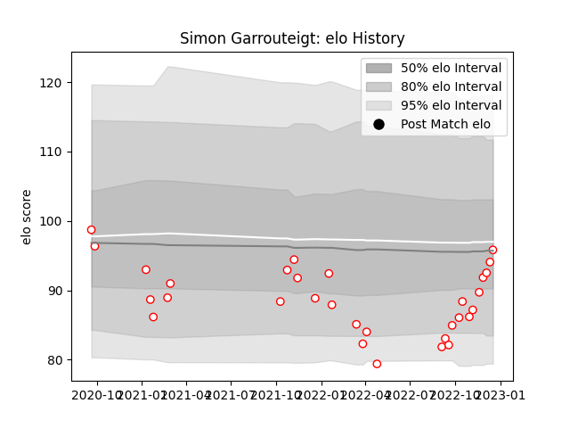

---  
layout: page  
title: Simon Garrouteigt  
date: 2022-12-18 16:20:30.765117  
categories: player  
---
# Simon Garrouteigt

## Positions: SH

## Current elo: 96.0

## Current Percentile: 31.0

# Elo History

# Match History

| Team   |   Appearances |   Win Rate |
|:-------|--------------:|-----------:|
| Dax    |            31 |   0.645161 |

| Opponent                   |   Matches |   Win Rate |
|:---------------------------|----------:|-----------:|
| Tarbes                     |         4 |   0.5      |
| Bourgoin-Jallieu           |         3 |   0.666667 |
| Dijon                      |         3 |   0.666667 |
| Narbonne                   |         3 |   0.666667 |
| Albi                       |         2 |   0.5      |
| Blagnac                    |         2 |   0.5      |
| Cognac Saint Jean d'Angély |         2 |   0.5      |
| Suresnes                   |         2 |   1        |
| US Bressane                |         2 |   1        |
| Valence Romans Drome Rugby |         2 |   0.5      |
| Aubenas                    |         1 |   0        |
| Carqueiranne-Hyères        |         1 |   1        |
| Chambery                   |         1 |   1        |
| Massy                      |         1 |   0        |
| Nice                       |         1 |   1        |
| Rennes                     |         1 |   1        |