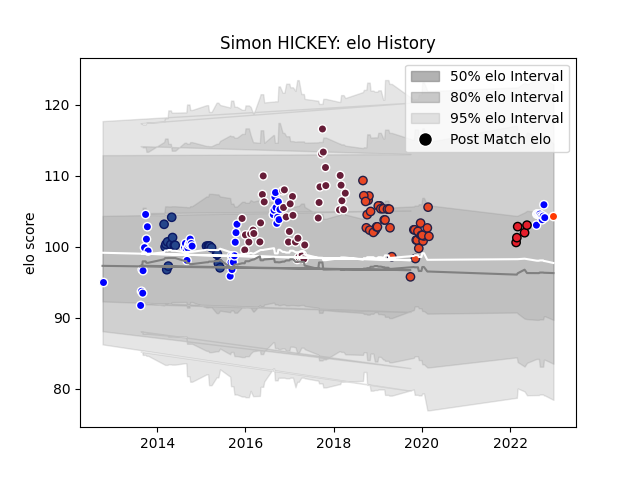

---  
layout: page  
title: Simon HICKEY  
date: 2023-01-23 15:31:29.831569  
categories: player  
---
# Simon HICKEY

## Positions: FH

## Current elo: 92.0

## Current Percentile: 48.0

# Elo History

# Match History

| Team              |   Appearances |   Win Rate |
|:------------------|--------------:|-----------:|
| Auckland          |            54 |   0.62037  |
| Bordeaux Begles   |            43 |   0.465116 |
| Edinburgh         |            43 |   0.639535 |
| Blues             |            20 |   0.35     |
| Crusaders         |             5 |   0.8      |
| Hino Red Dolphins |             3 |   0        |

| Opponent                         |   Matches |   Win Rate |
|:---------------------------------|----------:|-----------:|
| Toulon                           |         7 |   0.571429 |
| Canterbury                       |         7 |   0.142857 |
| Montpellier Herault              |         6 |   0.333333 |
| Stade Francais Paris             |         5 |   0.8      |
| North Harbour                    |         5 |   1        |
| Glasgow Warriors                 |         5 |   0.6      |
| Northland                        |         5 |   0.8      |
| Tasman                           |         5 |   0.7      |
| Taranaki                         |         5 |   0.4      |
| Manawatu                         |         4 |   1        |
| Grenoble                         |         4 |   1        |
| Hurricanes                       |         4 |   0.5      |
| Counties Manukau                 |         4 |   0.5      |
| Scarlets                         |         4 |   1        |
| Otago                            |         4 |   0.75     |
| Castres Olympique                |         4 |   0        |
| Waikato                          |         4 |   0.5      |
| Bay of Plenty                    |         4 |   0.75     |
| Racing 92                        |         3 |   0        |
| Oyonnax                          |         3 |   0.666667 |
| La Rochelle                      |         3 |   0.333333 |
| Dragons                          |         3 |   0.666667 |
| Newcastle Falcons                |         3 |   0.666667 |
| Southern Kings                   |         3 |   0.666667 |
| New South Wales Waratahs         |         3 |   0.333333 |
| Cheetahs                         |         3 |   0.666667 |
| Ulster                           |         3 |   0.333333 |
| Benetton Treviso                 |         3 |   0.333333 |
| Wellington                       |         3 |   0.333333 |
| Pau                              |         2 |   0.5      |
| Southland                        |         2 |   1        |
| Stade Toulousain                 |         2 |   0.25     |
| Wasps                            |         2 |   1        |
| Agen                             |         2 |   1        |
| Zebre                            |         2 |   0.5      |
| Munster                          |         2 |   0.5      |
| Hawke's Bay                      |         2 |   0.5      |
| Bordeaux Begles                  |         2 |   0.25     |
| Brive                            |         2 |   1        |
| Bulls                            |         2 |   0.5      |
| Cardiff Blues                    |         2 |   0.5      |
| Chiefs                           |         2 |   0        |
| Clermont Auvergne                |         2 |   0.75     |
| Crusaders                        |         2 |   0.5      |
| Highlanders                      |         2 |   1        |
| Leinster                         |         2 |   0.5      |
| Lions                            |         2 |   0        |
| Sharks                           |         1 |   0        |
| Fijian Drua                      |         1 |   1        |
| Moana Pasifika                   |         1 |   1        |
| Connacht                         |         1 |   1        |
| Queensland Reds                  |         1 |   1        |
| Lyon                             |         1 |   0        |
| Toyota Industries Shuttles Aichi |         1 |   0        |
| Brumbies                         |         1 |   0        |
| Urayasu D-Rocks                  |         1 |   0        |
| Ospreys                          |         1 |   0        |
| Melbourne Rebels                 |         1 |   0        |
| Bayonne                          |         1 |   0        |
| Mie Honda Heat                   |         1 |   0        |