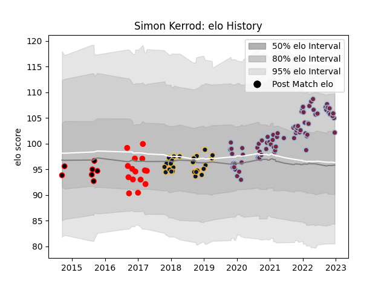

---  
layout: page  
title: Simon Kerrod  
date: 2023-01-06 00:13:13.552426  
categories: player  
---
# Simon Kerrod

## Positions: P

## Current elo: 99.0

## Current Percentile: 18.0

# Elo History

# Match History

| Team                   |   Appearances |   Win Rate |
|:-----------------------|--------------:|-----------:|
| Harlequins             |            77 |   0.564935 |
| Worcester Warriors     |            25 |   0.34     |
| Jersey                 |            17 |   0.529412 |
| Eastern Province Kings |            12 |   0.25     |

| Opponent             |   Matches |   Win Rate |
|:---------------------|----------:|-----------:|
| Sale Sharks          |         9 |   0.333333 |
| Bath Rugby           |         8 |   0.5      |
| Saracens             |         8 |   0.125    |
| Northampton Saints   |         8 |   0.625    |
| London Irish         |         8 |   0.5625   |
| Bristol Rugby        |         8 |   0.5      |
| Exeter Chiefs        |         7 |   0.428571 |
| Wasps                |         6 |   0.5      |
| Gloucester Rugby     |         6 |   1        |
| Newcastle Falcons    |         6 |   0.666667 |
| Leicester Tigers     |         5 |   0.6      |
| Worcester Warriors   |         3 |   0.666667 |
| Pumas                |         3 |   0.333333 |
| Ulster               |         2 |   0        |
| Stade Francais Paris |         2 |   1        |
| Rotherham Titans     |         2 |   0.5      |
| Bedford              |         2 |   0.5      |
| Oyonnax              |         2 |   0.5      |
| Ospreys              |         2 |   1        |
| Nottingham           |         2 |   0.5      |
| Natal Sharks         |         2 |   0        |
| Yorkshire Carnegie   |         2 |   0.5      |
| Harlequins           |         2 |   0        |
| Golden Lions         |         2 |   0        |
| Blue Bulls           |         2 |   0        |
| Ealing Trailfinders  |         2 |   0        |
| Doncaster            |         2 |   0.5      |
| Cardiff Blues        |         2 |   1        |
| Castres Olympique    |         2 |   1        |
| Connacht             |         2 |   0.25     |
| Clermont Auvergne    |         1 |   0        |
| Western Province     |         1 |   0        |
| Brive                |         1 |   0        |
| Sharks               |         1 |   0        |
| Cornish Pirates      |         1 |   1        |
| Griquas              |         1 |   1        |
| Richmond             |         1 |   1        |
| Racing 92            |         1 |   1        |
| Pau                  |         1 |   0        |
| Dragons              |         1 |   0        |
| Free State Cheetahs  |         1 |   1        |
| London Scottish      |         1 |   1        |