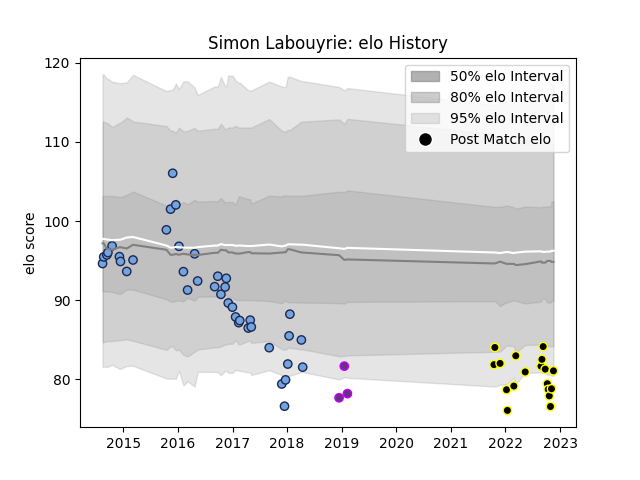

---  
layout: page  
title: Simon Labouyrie  
date: 2023-03-21 18:46:22.615235  
categories: player  
---
# Simon Labouyrie

Last updated: 2023-03-21
## Positions: H

## Current elo: 109.0

## Current Percentile: 24.0

# Elo History

# Match History

| Team           |   Appearances |   Win Rate |
|:---------------|--------------:|-----------:|
| Bayonne        |            68 |   0.514706 |
| Mont-de-Marsan |            25 |   0.6      |
| US Bressane    |             9 |   0.333333 |

| Opponent             |   Matches |   Win Rate |
|:---------------------|----------:|-----------:|
| Aurillac             |         7 |   0.857143 |
| Beziers              |         7 |   0.428571 |
| Carcassonne          |         6 |   0.833333 |
| Colomiers            |         6 |   0.75     |
| Montauban            |         5 |   0.6      |
| Narbonne             |         5 |   0.8      |
| Mont-de-Marsan       |         5 |   0.6      |
| Provence Rugby       |         4 |   0        |
| Nevers               |         4 |   0.5      |
| Massy                |         4 |   0.75     |
| Biarritz Olympique   |         4 |   0.75     |
| Grenoble             |         4 |   0.25     |
| Clermont Auvergne    |         3 |   0.333333 |
| Soyaux-Angouleme     |         3 |   0.333333 |
| Rouen                |         2 |   0.5      |
| Perpignan            |         2 |   0.5      |
| Stade Toulousain     |         2 |   0.5      |
| Agen                 |         2 |   0.5      |
| Vannes               |         2 |   0.5      |
| Brive                |         2 |   0.5      |
| Gloucester Rugby     |         2 |   0        |
| Exeter Chiefs        |         2 |   0.5      |
| Dax                  |         2 |   0.75     |
| Connacht             |         2 |   0        |
| Bourgoin-Jallieu     |         2 |   1        |
| US Bressane          |         1 |   1        |
| Toulon               |         1 |   0        |
| Tarbes               |         1 |   0        |
| Bayonne              |         1 |   0        |
| Stade Francais Paris |         1 |   0        |
| Lyon                 |         1 |   0        |
| Racing 92            |         1 |   0        |
| Albi                 |         1 |   1        |
| Pau                  |         1 |   0        |
| Oyonnax              |         1 |   1        |
| Montpellier Herault  |         1 |   0        |
| La Rochelle          |         1 |   0        |
| Castres Olympique    |         1 |   0        |