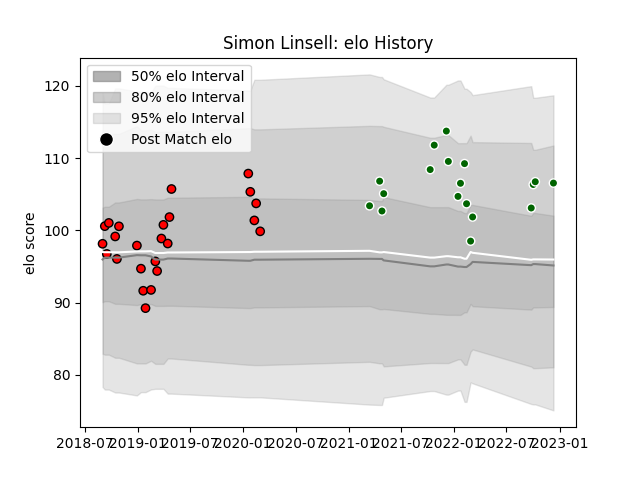

---  
layout: page  
title: Simon Linsell  
date: 2023-03-21 18:31:34.935742  
categories: player  
---
# Simon Linsell

Last updated: 2023-03-21
## Positions: L

## Current elo: 98.0

## Current Percentile: 58.0

# Elo History

# Match History

| Team                |   Appearances |   Win Rate |
|:--------------------|--------------:|-----------:|
| Ealing Trailfinders |            36 |   0.833333 |
| Hartpury College    |            24 |   0.333333 |

| Opponent            |   Matches |   Win Rate |
|:--------------------|----------:|-----------:|
| Bedford             |         6 |   0.5      |
| Coventry            |         6 |   0.833333 |
| Nottingham          |         6 |   0.666667 |
| Richmond            |         6 |   1        |
| Cornish Pirates     |         5 |   0.4      |
| Doncaster           |         5 |   0.2      |
| Hartpury College    |         5 |   1        |
| Jersey              |         5 |   0.8      |
| London Scottish     |         5 |   0.8      |
| Ampthill            |         4 |   0.75     |
| London Irish        |         2 |   0        |
| Yorkshire Carnegie  |         2 |   0.5      |
| Ealing Trailfinders |         1 |   0        |
| Newcastle Falcons   |         1 |   0        |
| Saracens            |         1 |   0        |