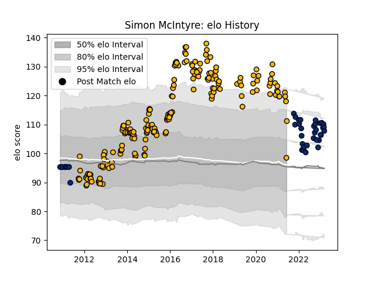

---  
layout: page  
title: Simon McIntyre  
date: 2023-03-21 18:37:43.033145  
categories: player  
---
# Simon McIntyre

Last updated: 2023-03-21
## Positions: P

## Current elo: 98.0

## Current Percentile: 93.0

# Elo History

# Match History

| Team        |   Appearances |   Win Rate |
|:------------|--------------:|-----------:|
| Wasps       |           193 |   0.525907 |
| Sale Sharks |            44 |   0.5      |

| Opponent             |   Matches |   Win Rate |
|:---------------------|----------:|-----------:|
| Exeter Chiefs        |        25 |   0.38     |
| Bath Rugby           |        21 |   0.5      |
| Leicester Tigers     |        21 |   0.52381  |
| Harlequins           |        19 |   0.368421 |
| Gloucester Rugby     |        17 |   0.676471 |
| Northampton Saints   |        17 |   0.470588 |
| Worcester Warriors   |        16 |   0.875    |
| London Irish         |        16 |   0.6875   |
| Saracens             |        16 |   0.25     |
| Sale Sharks          |        14 |   0.285714 |
| Newcastle Falcons    |         7 |   0.571429 |
| Bristol Rugby        |         6 |   0.833333 |
| Leinster             |         4 |   0.375    |
| Bayonne              |         4 |   0.875    |
| Toulon               |         3 |   0.333333 |
| Ulster               |         3 |   0.666667 |
| Wasps                |         3 |   0.666667 |
| Dragons              |         3 |   0        |
| Stade Toulousain     |         2 |   0.5      |
| Stade Francais Paris |         2 |   1        |
| Agen                 |         2 |   1        |
| London Welsh         |         2 |   1        |
| Arix Viadana         |         2 |   1        |
| La Rochelle          |         2 |   0.5      |
| Castres Olympique    |         2 |   1        |
| Bordeaux Begles      |         2 |   0        |
| Ospreys              |         1 |   0        |
| Cardiff Blues        |         1 |   0        |
| Brive                |         1 |   0        |
| Biarritz Olympique   |         1 |   0        |
| Yorkshire Carnegie   |         1 |   1        |
| Zebre                |         1 |   1        |