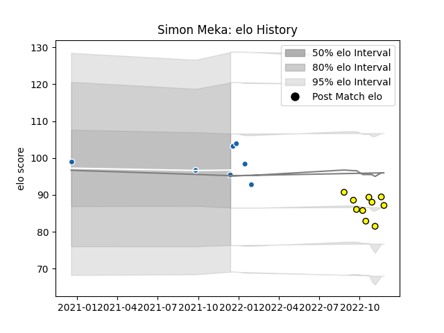

---  
layout: page  
title: Simon Meka  
date: 2022-11-22 11:36:35.944717  
categories: player  
---
# Simon Meka

## Positions: FL, L

## Current elo: 89.0

## Current Percentile: 15.0

# Elo History

# Match History

| Team              |   Appearances |   Win Rate |
|:------------------|--------------:|-----------:|
| Carcassonne       |             9 |   0.222222 |
| Castres Olympique |             6 |   0.166667 |

| Opponent             |   Matches |   Win Rate |
|:---------------------|----------:|-----------:|
| Munster              |         2 |          0 |
| Aurillac             |         1 |          1 |
| Biarritz Olympique   |         1 |          0 |
| Bordeaux Begles      |         1 |          0 |
| Colomiers            |         1 |          0 |
| Grenoble             |         1 |          0 |
| Massy                |         1 |          0 |
| Newcastle Falcons    |         1 |          0 |
| Oyonnax              |         1 |          0 |
| Perpignan            |         1 |          1 |
| Rouen                |         1 |          1 |
| Soyaux-Angouleme     |         1 |          0 |
| Stade Francais Paris |         1 |          0 |
| Vannes               |         1 |          0 |