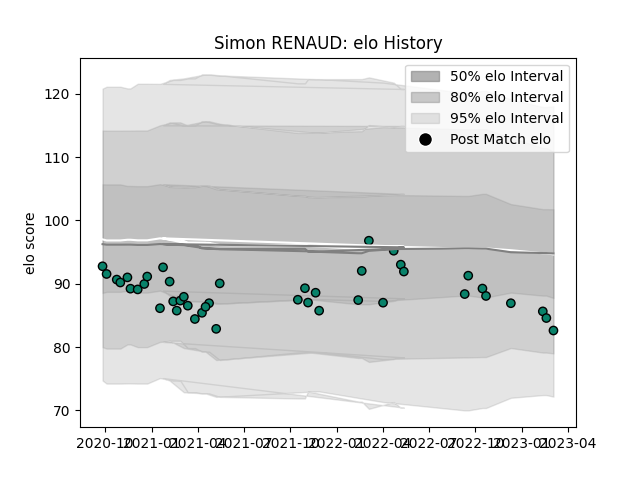

---  
layout: page  
title: Simon RENAUD  
date: 2023-03-12 11:34:29.744594  
categories: player  
---
# Simon RENAUD

## Positions: P

## Current elo: 89.0

## Current Percentile: 45.0

# Elo History

# Match History

| Team      |   Appearances |   Win Rate |
|:----------|--------------:|-----------:|
| Montauban |            43 |   0.348837 |

| Opponent                   |   Matches |   Win Rate |
|:---------------------------|----------:|-----------:|
| Oyonnax                    |         5 |   0.2      |
| Vannes                     |         4 |   0        |
| Provence Rugby             |         4 |   0.25     |
| Aurillac                   |         4 |   0.25     |
| Grenoble                   |         3 |   0.333333 |
| Nevers                     |         3 |   0.333333 |
| Agen                       |         3 |   0.666667 |
| Beziers                    |         3 |   0        |
| Mont-de-Marsan             |         2 |   0.5      |
| Colomiers                  |         2 |   0.5      |
| Rouen                      |         2 |   1        |
| Soyaux-Angouleme           |         2 |   1        |
| Valence Romans Drome Rugby |         2 |   0.5      |
| Carcassonne                |         1 |   0        |
| Biarritz Olympique         |         1 |   0        |
| Perpignan                  |         1 |   0        |
| Narbonne                   |         1 |   1        |