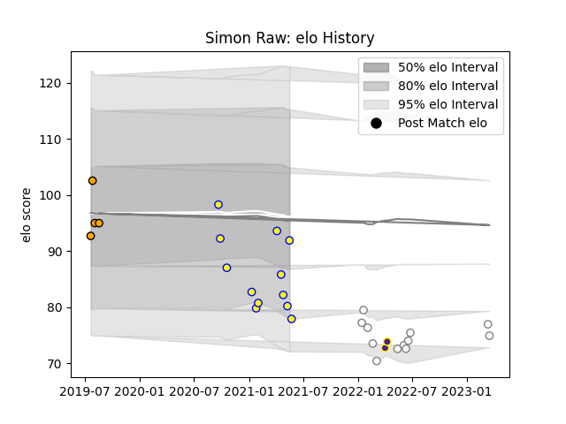

---  
layout: page  
title: Simon Raw  
date: 2023-03-16 11:29:57.814409  
categories: player  
---
# Simon Raw

## Positions: P

## Current elo: 92.0

## Current Percentile: 11.0

# Elo History

# Match History

| Team             |   Appearances |   Win Rate |
|:-----------------|--------------:|-----------:|
| Aubenas          |            12 |  0.0833333 |
| Pumas            |            11 |  0.454545  |
| Boland Cavaliers |             4 |  0.375     |
| Griffons         |             2 |  1         |

| Opponent                   |   Matches |   Win Rate |
|:---------------------------|----------:|-----------:|
| Griquas                    |         3 |   0.333333 |
| Free State Cheetahs        |         3 |   0.666667 |
| Suresnes                   |         2 |   0.5      |
| Massy                      |         2 |   0        |
| Blue Bulls                 |         2 |   0.5      |
| Albi                       |         2 |   0        |
| Eastern Province Kings     |         1 |   0        |
| Dax                        |         1 |   0        |
| Golden Lions               |         1 |   1        |
| Griffons                   |         1 |   0.5      |
| Cognac Saint Jean d'Angély |         1 |   0        |
| Chambery                   |         1 |   0        |
| Natal Sharks               |         1 |   0        |
| Nice                       |         1 |   0        |
| SWD Eagles                 |         1 |   1        |
| Border Bulldogs            |         1 |   1        |
| Tarbes                     |         1 |   0        |
| US Bressane                |         1 |   0        |
| Valke                      |         1 |   0        |
| Western Province           |         1 |   0        |
| Zimbabwe Goshawks          |         1 |   1        |