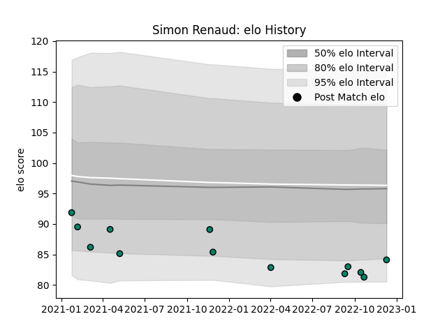

---  
layout: page  
title: Simon Renaud  
date: 2022-12-14 11:11:42.755975  
categories: player  
---
# Simon Renaud

## Positions: P

## Current elo: 84.0

## Current Percentile: 7.0

# Elo History

# Match History

| Team      |   Appearances |   Win Rate |
|:----------|--------------:|-----------:|
| Montauban |            13 |   0.230769 |

| Opponent           |   Matches |   Win Rate |
|:-------------------|----------:|-----------:|
| Agen               |         2 |          1 |
| Beziers            |         2 |          0 |
| Provence Rugby     |         2 |          0 |
| Aurillac           |         1 |          0 |
| Biarritz Olympique |         1 |          0 |
| Carcassonne        |         1 |          0 |
| Colomiers          |         1 |          0 |
| Grenoble           |         1 |          0 |
| Nevers             |         1 |          1 |
| Oyonnax            |         1 |          0 |