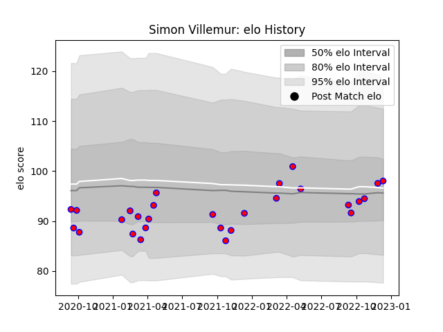

---  
layout: page  
title: Simon Villemur  
date: 2022-12-14 11:19:57.632782  
categories: player  
---
# Simon Villemur

## Positions: W

## Current elo: 98.0

## Current Percentile: 57.0

# Elo History

# Match History

| Team    |   Appearances |   Win Rate |
|:--------|--------------:|-----------:|
| Blagnac |            28 |   0.464286 |

| Opponent                   |   Matches |   Win Rate |
|:---------------------------|----------:|-----------:|
| Aubenas                    |         3 |   1        |
| Chambery                   |         3 |   0.666667 |
| Dax                        |         3 |   0.333333 |
| Suresnes                   |         3 |   0.666667 |
| Tarbes                     |         3 |   0.666667 |
| Valence Romans Drome Rugby |         3 |   0.333333 |
| Cognac Saint Jean d'Angély |         2 |   0.5      |
| Dijon                      |         2 |   0        |
| Albi                       |         1 |   1        |
| Bourgoin-Jallieu           |         1 |   0        |
| Massy                      |         1 |   0        |
| Narbonne                   |         1 |   0        |
| Nice                       |         1 |   0        |
| US Bressane                |         1 |   0        |