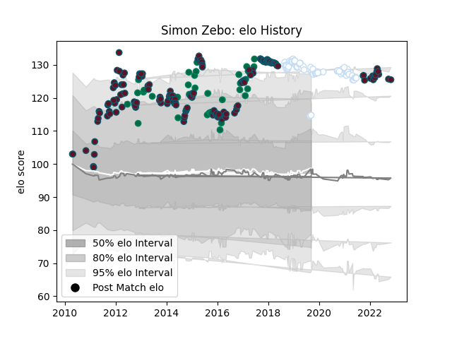

---  
layout: page  
title: Simon Zebo  
date: 2022-12-09 13:07:10.778002  
categories: player  
---
# Simon Zebo

## Positions: W, FB

## Country: Ireland

## Current elo: 108.0

## Current Percentile: 82.0

# Elo History

# Match History

| Team      |   Appearances |   Win Rate |
|:----------|--------------:|-----------:|
| Munster   |           158 |   0.648734 |
| Racing 92 |            59 |   0.635593 |
| Ireland   |            34 |   0.720588 |

| Opponent                 |   Matches |   Win Rate |
|:-------------------------|----------:|-----------:|
| Edinburgh                |        16 |   0.75     |
| Ospreys                  |        14 |   0.642857 |
| Ulster                   |        13 |   0.576923 |
| Glasgow Warriors         |        13 |   0.538462 |
| Leinster                 |        12 |   0.25     |
| Scarlets                 |        12 |   0.791667 |
| Benetton Treviso         |        11 |   0.818182 |
| Connacht                 |        10 |   0.7      |
| Dragons                  |         9 |   0.777778 |
| Zebre                    |         8 |   1        |
| Clermont Auvergne        |         8 |   0.4375   |
| Leicester Tigers         |         8 |   0.625    |
| Castres Olympique        |         7 |   0.785714 |
| Saracens                 |         7 |   0.571429 |
| Racing 92                |         7 |   0.571429 |
| Stade Toulousain         |         6 |   0.333333 |
| Toulon                   |         6 |   0.5      |
| Stade Francais Paris     |         5 |   0.6      |
| La Rochelle              |         5 |   0.4      |
| England                  |         5 |   0.4      |
| Pau                      |         4 |   0.75     |
| Lyon                     |         4 |   0.25     |
| Wales                    |         4 |   0.375    |
| Bordeaux Begles          |         4 |   0.5      |
| Italy                    |         4 |   1        |
| Cardiff Blues            |         4 |   0.75     |
| Argentina                |         3 |   1        |
| Scotland                 |         3 |   0.666667 |
| New Zealand              |         3 |   0.333333 |
| Agen                     |         3 |   0.833333 |
| Cheetahs                 |         2 |   1        |
| Perpignan                |         2 |   1        |
| United States of America |         2 |   1        |
| Australia                |         2 |   1        |
| South Africa             |         2 |   0.5      |
| Montpellier Herault      |         2 |   1        |
| Sale Sharks              |         2 |   1        |
| France                   |         2 |   1        |
| Aironi                   |         2 |   0.5      |
| Canada                   |         1 |   1        |
| Romania                  |         1 |   1        |
| Georgia                  |         1 |   1        |
| Bulls                    |         1 |   0        |
| Japan                    |         1 |   1        |
| Harlequins               |         1 |   1        |
| Sharks                   |         1 |   1        |
| Northampton Saints       |         1 |   1        |
| Grenoble                 |         1 |   1        |
| Bayonne                  |         1 |   1        |
| Stormers                 |         1 |   1        |
| Gloucester Rugby         |         1 |   1        |
| Munster                  |         1 |   0.5      |
| Exeter Chiefs            |         1 |   0        |
| Brive                    |         1 |   1        |