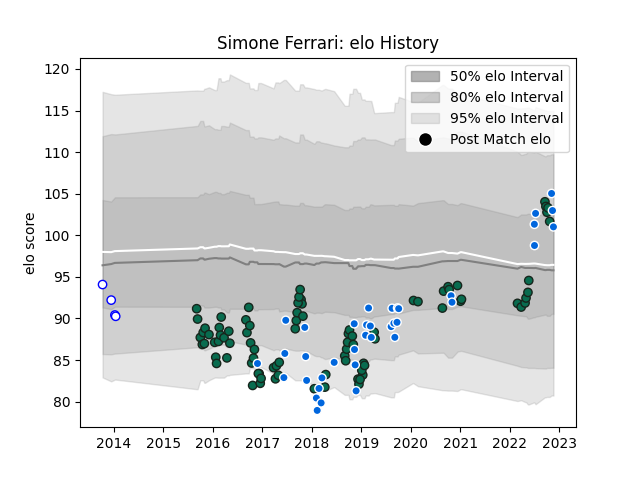

---  
layout: page  
title: Simone Ferrari  
date: 2023-01-13 11:33:16.316404  
categories: player  
---
# Simone Ferrari

## Positions: P

## Country: Italy

## Current elo: 100.0

## Current Percentile: 32.0

# Elo History

# Match History

| Team             |   Appearances |   Win Rate |
|:-----------------|--------------:|-----------:|
| Benetton Treviso |            91 |   0.384615 |
| Italy            |            38 |   0.315789 |
| Mogliano         |             4 |   0        |

| Opponent             |   Matches |   Win Rate |
|:---------------------|----------:|-----------:|
| Zebre                |         9 |   0.666667 |
| Leinster             |         9 |   0.166667 |
| Ulster               |         8 |   0.1875   |
| Dragons              |         8 |   0.625    |
| Munster              |         7 |   0        |
| Edinburgh            |         7 |   0.428571 |
| Scarlets             |         6 |   0.166667 |
| Cardiff Blues        |         6 |   0.5      |
| Ospreys              |         5 |   0.4      |
| Glasgow Warriors     |         4 |   0.5      |
| South Africa         |         4 |   0.25     |
| England              |         4 |   0        |
| Ireland              |         4 |   0        |
| Scotland             |         3 |   0        |
| Georgia              |         3 |   0.666667 |
| France               |         3 |   0        |
| Connacht             |         3 |   0.333333 |
| Bayonne              |         3 |   1        |
| Bath Rugby           |         3 |   0        |
| Australia            |         3 |   0.333333 |
| Harlequins           |         2 |   0.5      |
| Fiji                 |         2 |   0.5      |
| Stade Francais Paris |         2 |   0.5      |
| Southern Kings       |         2 |   1        |
| Bulls                |         2 |   0        |
| Wales                |         2 |   0        |
| Russia               |         1 |   1        |
| Toulon               |         1 |   0        |
| Tonga                |         1 |   0        |
| Sharks               |         1 |   0        |
| Samoa                |         1 |   1        |
| Agen                 |         1 |   1        |
| Romania              |         1 |   1        |
| Portugal             |         1 |   1        |
| New Zealand          |         1 |   0        |
| Namibia              |         1 |   1        |
| Lions                |         1 |   0        |
| Leicester Tigers     |         1 |   0        |
| Argentina            |         1 |   0        |
| Japan                |         1 |   1        |
| Grenoble             |         1 |   1        |
| Gloucester Rugby     |         1 |   0        |
| Canada               |         1 |   1        |
| Bordeaux Begles      |         1 |   0        |
| La Rochelle          |         1 |   0        |