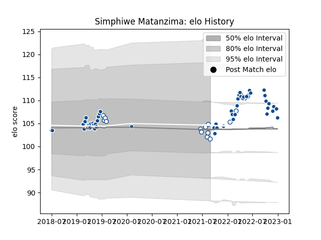

---  
layout: page  
title: Simphiwe Matanzima  
date: 2023-03-21 18:31:24.207756  
categories: player  
---
# Simphiwe Matanzima

Last updated: 2023-03-21
## Positions: P

## Current elo: 92.0

## Current Percentile: 43.0

# Elo History

# Match History

| Team       |   Appearances |   Win Rate |
|:-----------|--------------:|-----------:|
| Bulls      |            49 |   0.612245 |
| Blue Bulls |            17 |   0.705882 |

| Opponent                 |   Matches |   Win Rate |
|:-------------------------|----------:|-----------:|
| Sharks                   |         6 |   0.5      |
| Lions                    |         6 |   1        |
| Griquas                  |         4 |   0.75     |
| Western Province         |         4 |   0.5      |
| Stormers                 |         4 |   0.25     |
| Pumas                    |         3 |   1        |
| Jaguares                 |         3 |   0.333333 |
| Benetton Treviso         |         2 |   1        |
| Ospreys                  |         2 |   1        |
| Natal Sharks             |         2 |   0.5      |
| Munster                  |         2 |   0.5      |
| Leinster                 |         2 |   0.5      |
| Golden Lions             |         2 |   1        |
| Glasgow Warriors         |         2 |   0.5      |
| Free State Cheetahs      |         2 |   0.5      |
| Edinburgh                |         2 |   0.5      |
| Cardiff Blues            |         2 |   1        |
| Connacht                 |         2 |   0.5      |
| Queensland Reds          |         1 |   1        |
| Brumbies                 |         1 |   0        |
| Ulster                   |         1 |   1        |
| Sunwolves                |         1 |   0        |
| Chiefs                   |         1 |   0        |
| Scarlets                 |         1 |   1        |
| Crusaders                |         1 |   0        |
| Highlanders              |         1 |   0.5      |
| New South Wales Waratahs |         1 |   1        |
| Dragons                  |         1 |   1        |
| Melbourne Rebels         |         1 |   1        |
| Blues                    |         1 |   0.5      |
| Hurricanes               |         1 |   0        |
| Zebre                    |         1 |   1        |