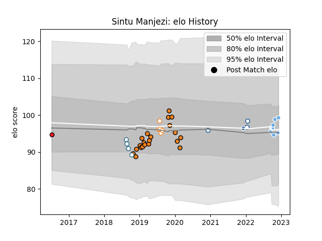

---  
layout: page  
title: Sintu Manjezi  
date: 2023-01-06 00:14:41.151262  
categories: player  
---
# Sintu Manjezi

## Positions: L

## Current elo: 101.0

## Current Percentile: 40.0

# Elo History

# Match History

| Team                |   Appearances |   Win Rate |
|:--------------------|--------------:|-----------:|
| Cheetahs            |            21 |   0.47619  |
| Glasgow Warriors    |            10 |   0.6      |
| Griquas             |             8 |   0.125    |
| Free State Cheetahs |             6 |   0.666667 |
| Blue Bulls          |             5 |   0.8      |
| Bulls               |             1 |   0        |
| Southern Kings      |             1 |   0        |

| Opponent            |   Matches |   Win Rate |
|:--------------------|----------:|-----------:|
| Zebre               |         4 |   0.75     |
| Western Province    |         4 |   0.75     |
| Southern Kings      |         4 |   1        |
| Natal Sharks        |         4 |   0        |
| Golden Lions        |         3 |   0        |
| Pumas               |         3 |   0.666667 |
| Ospreys             |         3 |   0.333333 |
| Benetton Treviso    |         3 |   0.666667 |
| Connacht            |         3 |   0        |
| Cardiff Blues       |         3 |   0.666667 |
| Free State Cheetahs |         2 |   1        |
| Blue Bulls          |         2 |   0.5      |
| Edinburgh           |         2 |   1        |
| Dragons             |         2 |   0.5      |
| Scarlets            |         2 |   0        |
| Sharks              |         2 |   0        |
| Glasgow Warriors    |         1 |   0        |
| Griquas             |         1 |   1        |
| Lions               |         1 |   0        |
| Ulster              |         1 |   0        |
| Bulls               |         1 |   1        |
| Leinster            |         1 |   0        |