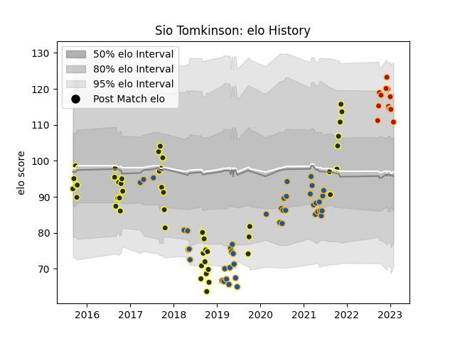

---  
layout: page  
title: Sio Tomkinson  
date: 2023-01-06 00:24:26.178927  
categories: player  
---
# Sio Tomkinson

## Positions: C, W

## Current elo: 115.0

## Current Percentile: 85.0

# Elo History

# Match History

| Team        |   Appearances |   Win Rate |
|:------------|--------------:|-----------:|
| Otago       |            48 |   0.5625   |
| Highlanders |            43 |   0.488372 |
| Dragons     |            10 |   0.15     |

| Opponent                 |   Matches |   Win Rate |
|:-------------------------|----------:|-----------:|
| Blues                    |         7 |   0.285714 |
| Chiefs                   |         7 |   0.642857 |
| Hurricanes               |         5 |   0.2      |
| Canterbury               |         5 |   0.2      |
| Southland                |         5 |   1        |
| Bay of Plenty            |         5 |   0.6      |
| Crusaders                |         5 |   0        |
| Auckland                 |         4 |   0.5      |
| Northland                |         4 |   1        |
| North Harbour            |         4 |   0.75     |
| Manawatu                 |         4 |   1        |
| Lions                    |         4 |   0.375    |
| Hawke's Bay              |         4 |   0.5      |
| Waikato                  |         4 |   0.5      |
| Tasman                   |         3 |   0        |
| Wellington               |         3 |   0.333333 |
| Brumbies                 |         3 |   1        |
| Sunwolves                |         2 |   1        |
| Queensland Reds          |         2 |   1        |
| Taranaki                 |         2 |   0        |
| Stormers                 |         2 |   0        |
| Sharks                   |         2 |   0        |
| Melbourne Rebels         |         2 |   0.5      |
| New South Wales Waratahs |         2 |   0.5      |
| Cardiff Blues            |         2 |   0        |
| Bulls                    |         2 |   0.75     |
| Scarlets                 |         1 |   0        |
| Pau                      |         1 |   0        |
| Munster                  |         1 |   1        |
| Jaguares                 |         1 |   1        |
| Edinburgh                |         1 |   0        |
| Counties Manukau         |         1 |   0        |
| Western Force            |         1 |   1        |