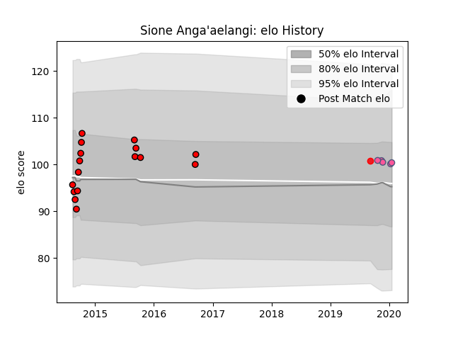

---  
layout: page  
title: Sione Anga'aelangi  
date: 2022-12-09 13:24:49.428227  
categories: player  
---
# Sione Anga'aelangi

## Positions: H

## Country: Tonga

## Current elo: 97.0

## Current Percentile: 56.0

# Elo History

# Match History

| Team                 |   Appearances |   Win Rate |
|:---------------------|--------------:|-----------:|
| Counties Manukau     |            16 |    0.40625 |
| Stade Francais Paris |             5 |    0.2     |
| Tonga                |             1 |    0       |

| Opponent      |   Matches |   Win Rate |
|:--------------|----------:|-----------:|
| Auckland      |         3 |   0.666667 |
| Taranaki      |         3 |   0.166667 |
| Brive         |         2 |   0        |
| Zebre         |         2 |   0.5      |
| Agen          |         1 |   0        |
| Bay of Plenty |         1 |   0        |
| Canterbury    |         1 |   0        |
| Hawke's Bay   |         1 |   0        |
| Manawatu      |         1 |   0        |
| New Zealand   |         1 |   0        |
| North Harbour |         1 |   0        |
| Otago         |         1 |   1        |
| Southland     |         1 |   1        |
| Tasman        |         1 |   1        |
| Waikato       |         1 |   0        |
| Wellington    |         1 |   1        |