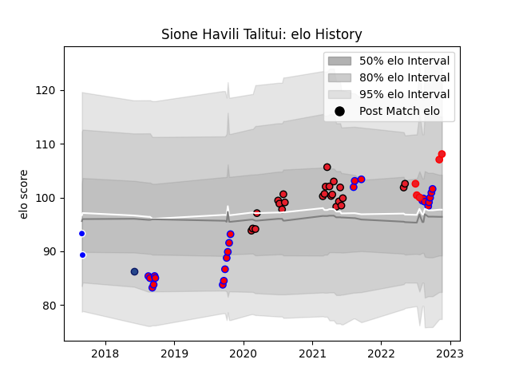

---  
layout: page  
title: Sione Havili Talitui  
date: 2023-03-29 11:28:30.899474  
categories: player  
---
# Sione Havili Talitui

Last updated: 2023-03-29
## Positions: FL, N8

## Country: Tonga

## Current elo: 106.0

## Current Percentile: 77.0

# Elo History

# Match History

| Team      |   Appearances |   Win Rate |
|:----------|--------------:|-----------:|
| Crusaders |            28 |   0.821429 |
| Tasman    |            24 |   0.75     |
| Tonga     |             6 |   0.666667 |
| Auckland  |             2 |   0        |
| Blues     |             1 |   0        |

| Opponent                 |   Matches |   Win Rate |
|:-------------------------|----------:|-----------:|
| Highlanders              |         6 |   0.833333 |
| Auckland                 |         5 |   0.6      |
| Blues                    |         5 |   1        |
| Chiefs                   |         4 |   0.75     |
| Hurricanes               |         3 |   0.666667 |
| Northland                |         3 |   1        |
| North Harbour            |         3 |   0.333333 |
| Wellington               |         2 |   0.5      |
| Waikato                  |         2 |   0.5      |
| Taranaki                 |         2 |   1        |
| Southland                |         2 |   1        |
| Queensland Reds          |         2 |   1        |
| New South Wales Waratahs |         2 |   0.5      |
| Melbourne Rebels         |         2 |   0.5      |
| Hawke's Bay              |         2 |   0.5      |
| Western Force            |         2 |   1        |
| Manawatu                 |         1 |   1        |
| Bay of Plenty            |         1 |   1        |
| Hong Kong                |         1 |   1        |
| Fijian Drua              |         1 |   0        |
| Otago                    |         1 |   0        |
| Fiji                     |         1 |   0        |
| Samoa                    |         1 |   0        |
| Counties Manukau         |         1 |   1        |
| Spain                    |         1 |   1        |
| Sunwolves                |         1 |   1        |
| Chile                    |         1 |   1        |
| Uruguay                  |         1 |   1        |
| Canterbury               |         1 |   1        |
| Brumbies                 |         1 |   1        |