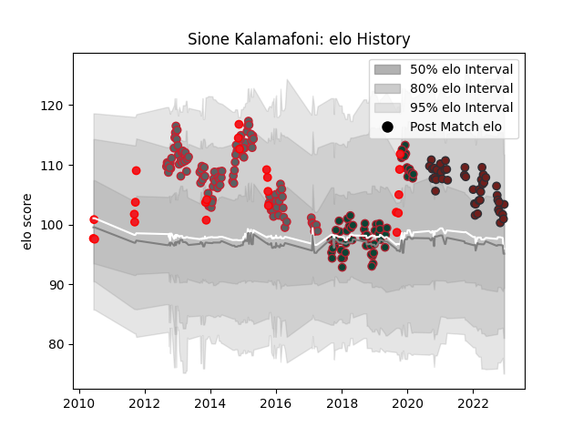

---  
layout: page  
title: Sione Kalamafoni  
date: 2022-12-09 13:17:31.594399  
categories: player  
---
# Sione Kalamafoni

## Positions: N8, FL

## Country: Tonga

## Current elo: 101.0

## Current Percentile: 66.0

# Elo History

# Match History

| Team             |   Appearances |   Win Rate |
|:-----------------|--------------:|-----------:|
| Gloucester Rugby |           106 |   0.537736 |
| Leicester Tigers |            64 |   0.429688 |
| Scarlets         |            43 |   0.383721 |
| Tonga            |            23 |   0.26087  |

| Opponent                 |   Matches |   Win Rate |
|:-------------------------|----------:|-----------:|
| Wasps                    |        16 |   0.375    |
| Bath Rugby               |        14 |   0.25     |
| Saracens                 |        13 |   0.230769 |
| Exeter Chiefs            |        12 |   0.416667 |
| London Irish             |        11 |   0.727273 |
| Sale Sharks              |        11 |   0.545455 |
| Harlequins               |        11 |   0.636364 |
| Northampton Saints       |        10 |   0.35     |
| Worcester Warriors       |        10 |   0.55     |
| Newcastle Falcons        |         8 |   0.75     |
| Leicester Tigers         |         7 |   0.285714 |
| Dragons                  |         6 |   0.666667 |
| Munster                  |         6 |   0        |
| Bristol Rugby            |         5 |   0.4      |
| Gloucester Rugby         |         5 |   0.6      |
| Connacht                 |         5 |   0.6      |
| Edinburgh                |         5 |   0.4      |
| Ulster                   |         5 |   0        |
| Cardiff Blues            |         5 |   0.4      |
| Racing 92                |         4 |   0        |
| London Welsh             |         4 |   1        |
| Zebre                    |         4 |   1        |
| Ospreys                  |         3 |   0.5      |
| Benetton Treviso         |         3 |   0.666667 |
| Bordeaux Begles          |         3 |   0.666667 |
| France                   |         3 |   0.333333 |
| New Zealand              |         3 |   0        |
| Glasgow Warriors         |         2 |   0.5      |
| United States of America |         2 |   1        |
| Stormers                 |         2 |   0        |
| Scarlets                 |         2 |   0.5      |
| Brive                    |         2 |   1        |
| Calvisano                |         2 |   1        |
| Japan                    |         2 |   0.5      |
| Pau                      |         2 |   0.5      |
| Oyonnax                  |         2 |   1        |
| Perpignan                |         2 |   1        |
| Argentina                |         2 |   0        |
| Lions                    |         2 |   0.5      |
| Georgia                  |         2 |   0.5      |
| Mont-de-Marsan           |         2 |   1        |
| Fiji                     |         2 |   0        |
| La Rochelle              |         1 |   1        |
| Biarritz Olympique       |         1 |   0        |
| Wales                    |         1 |   0        |
| Leinster                 |         1 |   0        |
| Toulon                   |         1 |   0        |
| Canada                   |         1 |   0        |
| Sharks                   |         1 |   0        |
| Castres Olympique        |         1 |   1        |
| Samoa                    |         1 |   0        |
| Bulls                    |         1 |   0        |
| Romania                  |         1 |   0        |
| England                  |         1 |   0        |
| Namibia                  |         1 |   1        |
| Scotland                 |         1 |   0        |