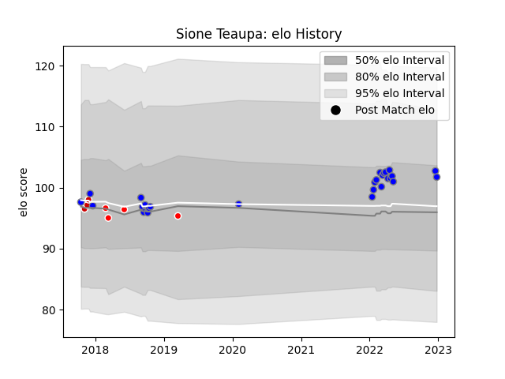

---  
layout: page  
title: Sione Teaupa  
date: 2023-01-13 11:31:52.991964  
categories: player  
---
# Sione Teaupa

## Positions: C

## Country: Japan

## Current elo: 100.0

## Current Percentile: 58.0

# Elo History

# Match History

| Team                              |   Appearances |   Win Rate |
|:----------------------------------|--------------:|-----------:|
| Kubota Spears Funabashi Tokyo-Bay |            28 |   0.732143 |
| Sunwolves                         |             4 |   0        |
| Japan                             |             3 |   0.5      |

| Opponent                        |   Matches |   Win Rate |
|:--------------------------------|----------:|-----------:|
| Yokohama Canon Eagles           |         4 |   0.625    |
| Green Rockets Tokatsu           |         3 |   0.666667 |
| Shizuoka Blue Revs              |         2 |   0.5      |
| Brumbies                        |         2 |   0        |
| Coca-Cola Red Sparks            |         2 |   1        |
| Urayasu D-Rocks                 |         2 |   1        |
| Kobelco Kobe Steelers           |         2 |   0.5      |
| Toshiba Brave Lupus Tokyo       |         2 |   1        |
| Munakata Sanix Blues            |         2 |   1        |
| Tokyo Sungoliath                |         2 |   0.5      |
| Saitama Wild Knights            |         2 |   0        |
| Toyota Verblitz                 |         1 |   1        |
| Tonga                           |         1 |   1        |
| Australia                       |         1 |   0        |
| Sharks                          |         1 |   0        |
| Queensland Reds                 |         1 |   0        |
| Black Rams Tokyo                |         1 |   1        |
| Mie Honda Heat                  |         1 |   1        |
| Hanazono Kintetsu Liners        |         1 |   1        |
| France                          |         1 |   0.5      |
| NTT Docomo Red Hurricanes Osaka |         1 |   1        |