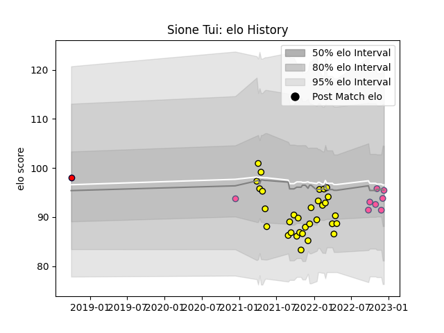

---  
layout: page  
title: Sione Tui  
date: 2023-01-06 00:18:10.852540  
categories: player  
---
# Sione Tui

## Positions: FB, W

## Current elo: 119.0

## Current Percentile: 87.0

# Elo History

# Match History

| Team                 |   Appearances |   Win Rate |
|:---------------------|--------------:|-----------:|
| Carcassonne          |            32 |   0.609375 |
| Stade Francais Paris |            10 |   0.45     |
| Melbourne Rising     |             4 |   0.25     |

| Opponent                   |   Matches |   Win Rate |
|:---------------------------|----------:|-----------:|
| Montauban                  |         3 |   0.666667 |
| Vannes                     |         3 |   0.5      |
| Provence Rugby             |         3 |   0.333333 |
| Grenoble                   |         3 |   0.333333 |
| Agen                       |         2 |   0.5      |
| US Bressane                |         2 |   1        |
| Rouen                      |         2 |   1        |
| Nevers                     |         2 |   0.5      |
| Aurillac                   |         2 |   0.5      |
| Narbonne                   |         2 |   1        |
| Benetton Treviso           |         2 |   0.5      |
| Colomiers                  |         2 |   1        |
| Beziers                    |         2 |   1        |
| Lyon                       |         1 |   0        |
| Bordeaux Begles            |         1 |   0        |
| Valence Romans Drome Rugby |         1 |   0        |
| Toulon                     |         1 |   0        |
| Sydney Rays                |         1 |   1        |
| Stade Toulousain           |         1 |   0.5      |
| Soyaux-Angouleme           |         1 |   1        |
| Racing 92                  |         1 |   1        |
| Mont-de-Marsan             |         1 |   0        |
| Brisbane City              |         1 |   0        |
| Pau                        |         1 |   1        |
| Oyonnax                    |         1 |   0        |
| Canberra Vikings           |         1 |   0        |
| Montpellier Herault        |         1 |   0        |
| La Rochelle                |         1 |   1        |
| Western Force              |         1 |   0        |