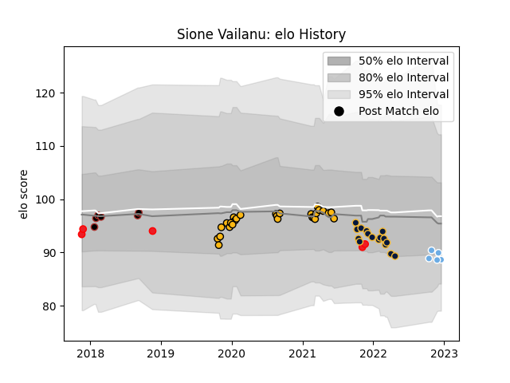

---  
layout: page  
title: Sione Vailanu  
date: 2022-12-12 15:22:26.376359  
categories: player  
---
# Sione Vailanu

## Positions: N8

## Country: Tonga

## Current elo: 90.0

## Current Percentile: 22.0

# Elo History

# Match History

| Team               |   Appearances |   Win Rate |
|:-------------------|--------------:|-----------:|
| Wasps              |            27 |   0.37037  |
| Worcester Warriors |            16 |   0.28125  |
| Saracens           |             6 |   0.833333 |
| Tonga              |             5 |   0.2      |
| Glasgow Warriors   |             4 |   0.5      |

| Opponent           |   Matches |   Win Rate |
|:-------------------|----------:|-----------:|
| Leicester Tigers   |         6 |   0        |
| Northampton Saints |         6 |   0.333333 |
| Newcastle Falcons  |         5 |   0.7      |
| Worcester Warriors |         4 |   1        |
| Bristol Rugby      |         4 |   0.75     |
| Sale Sharks        |         4 |   0.25     |
| Exeter Chiefs      |         3 |   0.333333 |
| Gloucester Rugby   |         3 |   0        |
| London Irish       |         3 |   0        |
| Wasps              |         2 |   0.5      |
| Saracens           |         2 |   0.5      |
| Harlequins         |         2 |   0        |
| Romania            |         2 |   0.5      |
| Wales              |         1 |   0        |
| Sharks             |         1 |   0        |
| Agen               |         1 |   1        |
| Leinster           |         1 |   0        |
| Bath Rugby         |         1 |   1        |
| Japan              |         1 |   0        |
| England            |         1 |   0        |
| Edinburgh          |         1 |   0        |
| Dragons            |         1 |   1        |
| Bordeaux Begles    |         1 |   0        |
| Benetton Treviso   |         1 |   1        |
| Zebre              |         1 |   1        |