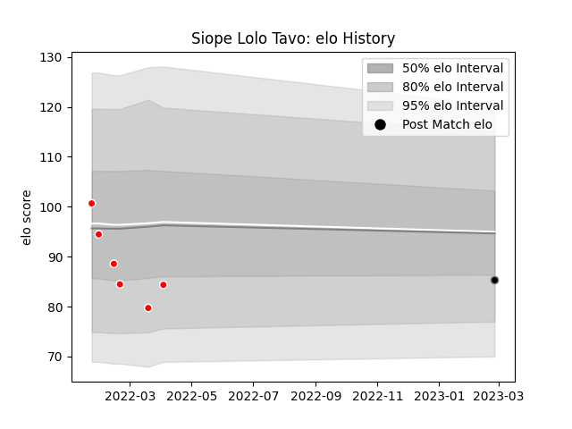

---  
layout: page  
title: Siope Lolo Tavo  
date: 2023-02-28 11:08:20.215333  
categories: player  
---
# Siope Lolo Tavo

## Positions: C

## Current elo: 85.0

## Current Percentile: 19.0

# Elo History

# Match History

| Team                  |   Appearances |   Win Rate |
|:----------------------|--------------:|-----------:|
| Chugoku Red Regulions |             6 |   0.166667 |
| Black Rams Tokyo      |             1 |   1        |

| Opponent                         |   Matches |   Win Rate |
|:---------------------------------|----------:|-----------:|
| Kurita Water Gush                |         2 |        0.5 |
| Hanazono Kintetsu Liners         |         1 |        1   |
| Kyuden Voltex                    |         1 |        0   |
| Munakata Sanix Blues             |         1 |        0   |
| Shimizu Blue Sharks              |         1 |        0   |
| Toyota Industries Shuttles Aichi |         1 |        0   |