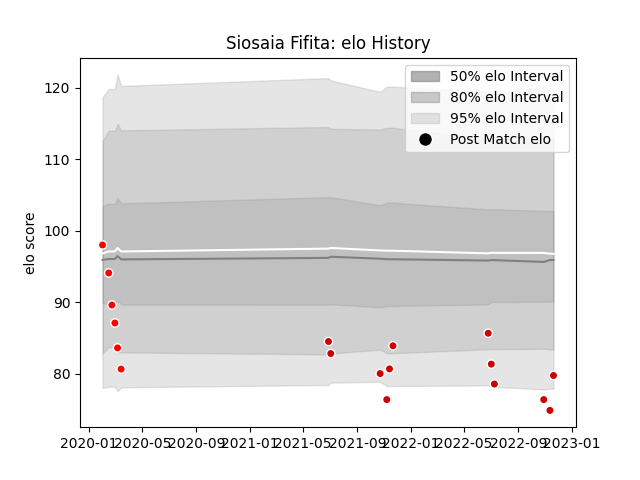

---  
layout: page  
title: Siosaia Fifita  
date: 2023-02-02 19:14:43.333485  
categories: player  
---
# Siosaia Fifita

## Positions: W, C

## Country: Japan

## Current elo: 76.0

## Current Percentile: 10.0

# Elo History

# Match History

| Team                     |   Appearances |   Win Rate |
|:-------------------------|--------------:|-----------:|
| Japan                    |            12 |   0.166667 |
| Sunwolves                |             6 |   0.166667 |
| Hanazono Kintetsu Liners |             4 |   0        |

| Opponent                          |   Matches |   Win Rate |
|:----------------------------------|----------:|-----------:|
| France                            |         3 |          0 |
| Ireland                           |         2 |          0 |
| Australia                         |         1 |          0 |
| New Zealand                       |         1 |          0 |
| Uruguay                           |         1 |          1 |
| Toshiba Brave Lupus Tokyo         |         1 |          0 |
| Tokyo Sungoliath                  |         1 |          0 |
| Scotland                          |         1 |          0 |
| Queensland Reds                   |         1 |          0 |
| Portugal                          |         1 |          1 |
| Kubota Spears Funabashi Tokyo-Bay |         1 |          0 |
| Melbourne Rebels                  |         1 |          1 |
| British and Irish Lions           |         1 |          0 |
| Hurricanes                        |         1 |          0 |
| England                           |         1 |          0 |
| Crusaders                         |         1 |          0 |
| Chiefs                            |         1 |          0 |
| Brumbies                          |         1 |          0 |
| Yokohama Canon Eagles             |         1 |          0 |