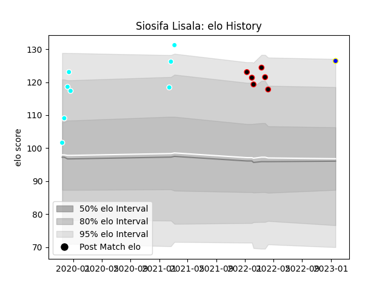

---  
layout: page  
title: Siosifa Lisala  
date: 2023-01-21 15:45:17.221633  
categories: player  
---
# Siosifa Lisala

## Positions: C, W

## Current elo: 127.0

## Current Percentile: 89.0

# Elo History

# Match History

| Team                             |   Appearances |   Win Rate |
|:---------------------------------|--------------:|-----------:|
| Toyota Industries Shuttles Aichi |             8 |      0.875 |
| NTT Docomo Red Hurricanes Osaka  |             6 |      0     |
| Urayasu D-Rocks                  |             1 |      1     |

| Opponent                          |   Matches |   Win Rate |
|:----------------------------------|----------:|-----------:|
| Kyuden Voltex                     |         2 |          1 |
| Tokyo Sungoliath                  |         2 |          0 |
| Black Rams Tokyo                  |         1 |          0 |
| Chugoku Red Regulions             |         1 |          1 |
| Coca-Cola Red Sparks              |         1 |          1 |
| Hanazono Kintetsu Liners          |         1 |          0 |
| Hino Red Dolphins                 |         1 |          1 |
| Kamaishi Seawaves                 |         1 |          1 |
| Kubota Spears Funabashi Tokyo-Bay |         1 |          0 |
| Kurita Water Gush                 |         1 |          1 |
| Mazda Blue Zoomers                |         1 |          1 |
| Shizuoka Blue Revs                |         1 |          0 |
| Yokohama Canon Eagles             |         1 |          0 |