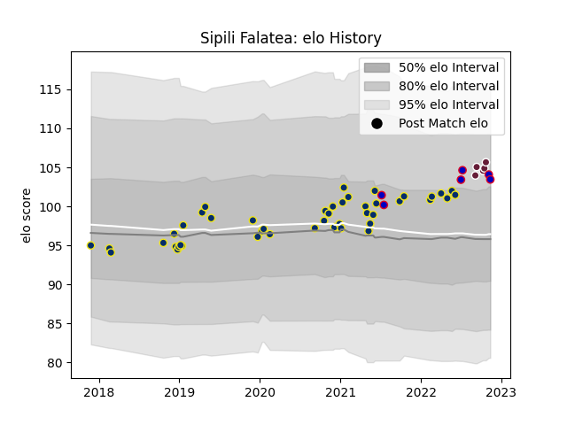

---  
layout: page  
title: Sipili Falatea  
date: 2022-11-15 23:37:26.617878  
categories: player  
---
# Sipili Falatea

## Positions: P

## Country: France

## Current elo: 103.0

## Current Percentile: 83.0

# Elo History

# Match History

| Team              |   Appearances |   Win Rate |
|:------------------|--------------:|-----------:|
| Clermont Auvergne |            45 |   0.611111 |
| France            |             6 |   0.666667 |
| Bordeaux Begles   |             5 |   0.3      |

| Opponent             |   Matches |   Win Rate |
|:---------------------|----------:|-----------:|
| Stade Toulousain     |         6 |   0.25     |
| Montpellier Herault  |         5 |   0.4      |
| La Rochelle          |         4 |   0.5      |
| Lyon                 |         4 |   0.25     |
| Racing 92            |         3 |   0.333333 |
| Toulon               |         3 |   0.333333 |
| Brive                |         3 |   0.666667 |
| Stade Francais Paris |         3 |   1        |
| Australia            |         3 |   0.333333 |
| Pau                  |         3 |   1        |
| Bordeaux Begles      |         2 |   0.25     |
| Timisoara Saracens   |         2 |   1        |
| Dragons              |         2 |   1        |
| Japan                |         2 |   1        |
| Oyonnax              |         2 |   0.25     |
| South Africa         |         1 |   1        |
| Agen                 |         1 |   1        |
| Perpignan            |         1 |   1        |
| Northampton Saints   |         1 |   1        |
| Harlequins           |         1 |   1        |
| Clermont Auvergne    |         1 |   0.5      |
| Castres Olympique    |         1 |   1        |
| Biarritz Olympique   |         1 |   1        |
| Ulster               |         1 |   1        |