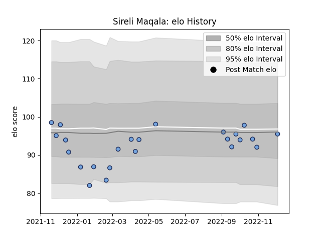

---  
layout: page  
title: Sireli Maqala  
date: 2022-12-12 15:10:57.819130  
categories: player  
---
# Sireli Maqala

## Positions: C

## Current elo: 95.0

## Current Percentile: 37.0

# Elo History

# Match History

| Team    |   Appearances |   Win Rate |
|:--------|--------------:|-----------:|
| Bayonne |            24 |     0.6875 |

| Opponent             |   Matches |   Win Rate |
|:---------------------|----------:|-----------:|
| Montauban            |         2 |        1   |
| Oyonnax              |         2 |        0.5 |
| Rouen                |         2 |        1   |
| US Bressane          |         2 |        1   |
| Carcassonne          |         1 |        1   |
| Colomiers            |         1 |        1   |
| Grenoble             |         1 |        0   |
| La Rochelle          |         1 |        1   |
| Lyon                 |         1 |        1   |
| Mont-de-Marsan       |         1 |        0   |
| Beziers              |         1 |        0   |
| Nevers               |         1 |        1   |
| Brive                |         1 |        0   |
| Perpignan            |         1 |        1   |
| Racing 92            |         1 |        1   |
| Bordeaux Begles      |         1 |        1   |
| Stade Francais Paris |         1 |        0   |
| Stade Toulousain     |         1 |        1   |
| Toulon               |         1 |        0   |
| Agen                 |         1 |        0.5 |