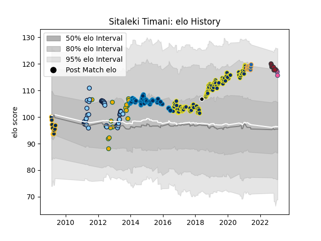

---  
layout: page  
title: Sitaleki Timani  
date: 2022-11-15 23:36:03.781512  
categories: player  
---
# Sitaleki Timani

## Positions: L

## Country: Barbarians

## Current elo: 119.0

## Current Percentile: 96.0

# Elo History

# Match History

| Team                     |   Appearances |   Win Rate |
|:-------------------------|--------------:|-----------:|
| Clermont Auvergne        |           105 |   0.661905 |
| New South Wales Waratahs |            43 |   0.418605 |
| Montpellier Herault      |            37 |   0.432432 |
| Australia                |            14 |   0.678571 |
| Brumbies                 |            11 |   0.727273 |
| Western Force            |            11 |   0.272727 |
| Toulon                   |             7 |   0.428571 |
| Barbarians               |             1 |   1        |

| Opponent                 |   Matches |   Win Rate |
|:-------------------------|----------:|-----------:|
| La Rochelle              |        12 |   0.5      |
| Castres Olympique        |        12 |   0.583333 |
| Lyon                     |        11 |   0.727273 |
| Bordeaux Begles          |        11 |   0.454545 |
| Stade Toulousain         |        10 |   0.35     |
| Racing 92                |         9 |   0.333333 |
| Toulon                   |         9 |   0.444444 |
| Stade Francais Paris     |         9 |   0.777778 |
| Bayonne                  |         8 |   0.75     |
| Brumbies                 |         8 |   0.375    |
| Queensland Reds          |         8 |   0.375    |
| Pau                      |         8 |   0.625    |
| Montpellier Herault      |         8 |   0.375    |
| Western Force            |         6 |   0.666667 |
| Melbourne Rebels         |         6 |   0.666667 |
| Grenoble                 |         5 |   0.7      |
| Harlequins               |         5 |   0.8      |
| Agen                     |         5 |   1        |
| Crusaders                |         5 |   0.2      |
| Blues                    |         5 |   0.4      |
| Cheetahs                 |         4 |   0.25     |
| Bulls                    |         4 |   0.25     |
| Chiefs                   |         4 |   0.5      |
| Northampton Saints       |         4 |   1        |
| Brive                    |         4 |   0.5      |
| Ulster                   |         3 |   0.333333 |
| Stormers                 |         3 |   0.666667 |
| South Africa             |         3 |   0.666667 |
| Highlanders              |         3 |   0.666667 |
| Perpignan                |         3 |   0.666667 |
| Argentina                |         3 |   1        |
| Hurricanes               |         3 |   0        |
| New Zealand              |         3 |   0.166667 |
| Clermont Auvergne        |         3 |   0.666667 |
| England                  |         3 |   0.666667 |
| Oyonnax                  |         2 |   0.25     |
| Bath Rugby               |         2 |   1        |
| New South Wales Waratahs |         2 |   1        |
| Sharks                   |         2 |   0.5      |
| Italy                    |         2 |   1        |
| Wales                    |         1 |   1        |
| Timisoara Saracens       |         1 |   1        |
| Glasgow Warriors         |         1 |   0        |
| Southern Kings           |         1 |   1        |
| Saracens                 |         1 |   1        |
| Cardiff Blues            |         1 |   1        |
| Ospreys                  |         1 |   1        |
| Dragons                  |         1 |   1        |
| Lions                    |         1 |   0        |