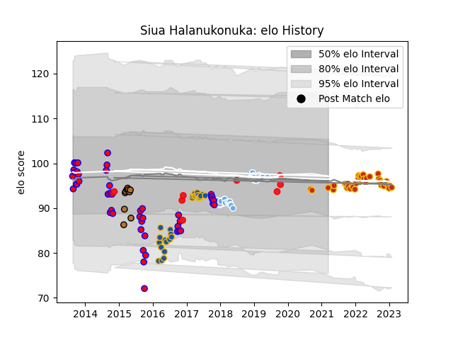

---  
layout: page  
title: Siua Halanukonuka  
date: 2022-12-09 13:12:33.026500  
categories: player  
---
# Siua Halanukonuka

## Positions: P

## Country: Tonga

## Current elo: 104.0

## Current Percentile: 79.0

# Elo History

# Match History

| Team             |   Appearances |   Win Rate |
|:-----------------|--------------:|-----------:|
| Tasman           |            47 |   0.702128 |
| Perpignan        |            34 |   0.411765 |
| Glasgow Warriors |            31 |   0.516129 |
| Highlanders      |            28 |   0.821429 |
| Tonga            |             7 |   0.714286 |
| Narbonne         |             3 |   0.333333 |

| Opponent                 |   Matches |   Win Rate |
|:-------------------------|----------:|-----------:|
| Taranaki                 |         7 |   0.571429 |
| Canterbury               |         6 |   0.333333 |
| Auckland                 |         5 |   0.5      |
| Edinburgh                |         5 |   0.2      |
| Counties Manukau         |         5 |   0.4      |
| Montpellier Herault      |         4 |   0        |
| North Harbour            |         4 |   0.625    |
| Hawke's Bay              |         4 |   1        |
| Crusaders                |         4 |   0.25     |
| Cheetahs                 |         3 |   1        |
| Otago                    |         3 |   1        |
| Pau                      |         3 |   0        |
| Racing 92                |         3 |   0.333333 |
| Clermont Auvergne        |         3 |   0.333333 |
| Scarlets                 |         3 |   0.333333 |
| Southland                |         3 |   1        |
| Brumbies                 |         3 |   1        |
| Biarritz Olympique       |         3 |   0.666667 |
| Waikato                  |         3 |   1        |
| Toulon                   |         3 |   0.666667 |
| Lyon                     |         3 |   0.666667 |
| Stade Toulousain         |         3 |   0.333333 |
| Rouen                    |         2 |   0.5      |
| Ulster                   |         2 |   0.5      |
| Bay of Plenty            |         2 |   1        |
| Saracens                 |         2 |   0        |
| Stade Francais Paris     |         2 |   0        |
| Ospreys                  |         2 |   1        |
| Wellington               |         2 |   1        |
| New South Wales Waratahs |         2 |   1        |
| Western Force            |         2 |   1        |
| Melbourne Rebels         |         2 |   1        |
| United States of America |         2 |   1        |
| Manawatu                 |         2 |   1        |
| Zebre                    |         2 |   1        |
| Bordeaux Begles          |         2 |   1        |
| Castres Olympique        |         2 |   0.5      |
| Chiefs                   |         2 |   1        |
| Connacht                 |         2 |   1        |
| Brive                    |         2 |   0.5      |
| Cardiff Blues            |         2 |   1        |
| Hurricanes               |         2 |   0.5      |
| Blues                    |         2 |   1        |
| Leinster                 |         2 |   0        |
| British and Irish Lions  |         1 |   1        |
| Vannes                   |         1 |   1        |
| Tarbes                   |         1 |   0        |
| Bulls                    |         1 |   1        |
| Sunwolves                |         1 |   1        |
| Beziers                  |         1 |   1        |
| Benetton Treviso         |         1 |   0        |
| Stormers                 |         1 |   1        |
| Carcassonne              |         1 |   1        |
| Lions                    |         1 |   1        |
| Spain                    |         1 |   1        |
| Mont-de-Marsan           |         1 |   0        |
| Exeter Chiefs            |         1 |   1        |
| Fiji                     |         1 |   1        |
| Queensland Reds          |         1 |   0        |
| France                   |         1 |   0        |
| Italy                    |         1 |   1        |
| Northland                |         1 |   1        |
| Jaguares                 |         1 |   1        |
| New Zealand              |         1 |   0        |
| La Rochelle              |         1 |   0        |
| Munster                  |         1 |   0        |
| Southern Kings           |         1 |   1        |