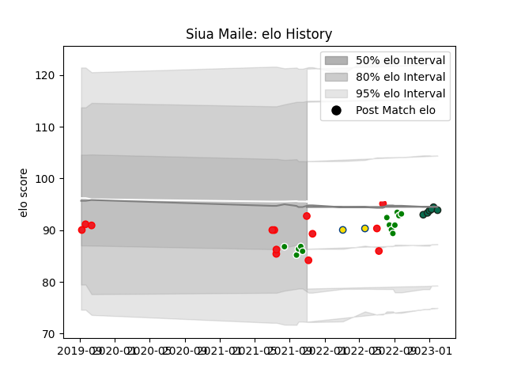

---  
layout: page  
title: Siua Maile  
date: 2023-01-06 00:19:12.107371  
categories: player  
---
# Siua Maile

## Positions: H

## Country: Tonga

## Current elo: 102.0

## Current Percentile: 25.0

# Elo History

# Match History

| Team             |   Appearances |   Win Rate |
|:-----------------|--------------:|-----------:|
| Manawatu         |            13 |   0.230769 |
| Tonga            |            13 |   0.153846 |
| Benetton Treviso |             3 |   0.666667 |
| Hurricanes       |             2 |   1        |

| Opponent                 |   Matches |   Win Rate |
|:-------------------------|----------:|-----------:|
| Samoa                    |         4 |        0   |
| Canterbury               |         2 |        0   |
| New Zealand              |         2 |        0   |
| Otago                    |         2 |        0.5 |
| England                  |         2 |        0   |
| Zebre                    |         2 |        1   |
| Hong Kong                |         1 |        1   |
| Southland                |         1 |        1   |
| Wellington               |         1 |        0   |
| Waikato                  |         1 |        0   |
| United States of America |         1 |        1   |
| Tasman                   |         1 |        0   |
| Taranaki                 |         1 |        0   |
| Stade Francais Paris     |         1 |        0   |
| Scotland                 |         1 |        0   |
| Melbourne Rebels         |         1 |        1   |
| Highlanders              |         1 |        1   |
| Romania                  |         1 |        0   |
| Counties Manukau         |         1 |        0   |
| Northland                |         1 |        1   |
| North Harbour            |         1 |        0   |
| Fiji                     |         1 |        0   |
| Hawke's Bay              |         1 |        0   |