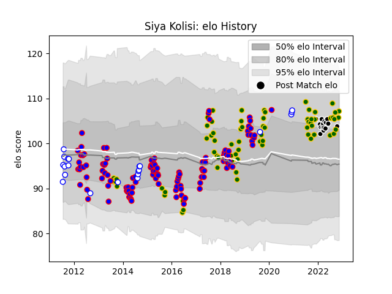

---  
layout: page  
title: Siya Kolisi  
date: 2022-11-22 11:36:31.489105  
categories: player  
---
# Siya Kolisi

## Positions: FL

## Country: South Africa

## Current elo: 109.0

## Current Percentile: 79.0

# Elo History

# Match History

| Team             |   Appearances |   Win Rate |
|:-----------------|--------------:|-----------:|
| Stormers         |           115 |   0.569565 |
| South Africa     |            70 |   0.628571 |
| Western Province |            21 |   0.642857 |
| Sharks           |            15 |   0.7      |

| Opponent                 |   Matches |   Win Rate |
|:-------------------------|----------:|-----------:|
| Bulls                    |        16 |   0.625    |
| Argentina                |        12 |   0.833333 |
| Lions                    |        12 |   0.541667 |
| Sharks                   |        12 |   0.416667 |
| New Zealand              |        11 |   0.272727 |
| Cheetahs                 |        11 |   0.727273 |
| Australia                |        10 |   0.5      |
| Chiefs                   |         7 |   0.285714 |
| Queensland Reds          |         6 |   0.666667 |
| Brumbies                 |         6 |   0.5      |
| Golden Lions             |         6 |   0.333333 |
| Blues                    |         6 |   0.666667 |
| New South Wales Waratahs |         6 |   0.333333 |
| England                  |         6 |   0.5      |
| France                   |         6 |   0.833333 |
| Wales                    |         6 |   0.666667 |
| Hurricanes               |         6 |   0.5      |
| Highlanders              |         6 |   0.5      |
| Melbourne Rebels         |         5 |   0.8      |
| Sunwolves                |         5 |   0.7      |
| Jaguares                 |         5 |   0.8      |
| Ireland                  |         5 |   0.4      |
| Western Force            |         4 |   1        |
| Blue Bulls               |         4 |   0.75     |
| Crusaders                |         4 |   0.125    |
| Natal Sharks             |         3 |   0.666667 |
| Pumas                    |         3 |   1        |
| Japan                    |         3 |   0.666667 |
| British and Irish Lions  |         3 |   0.666667 |
| Stormers                 |         2 |   0.25     |
| Italy                    |         2 |   1        |
| Scotland                 |         2 |   1        |
| Eastern Province Kings   |         2 |   1        |
| Southern Kings           |         2 |   1        |
| Griquas                  |         1 |   0.5      |
| Samoa                    |         1 |   1        |
| Ulster                   |         1 |   0        |
| Benetton Treviso         |         1 |   1        |
| Scarlets                 |         1 |   1        |
| Connacht                 |         1 |   1        |
| Canada                   |         1 |   1        |
| Glasgow Warriors         |         1 |   1        |
| Namibia                  |         1 |   1        |
| Dragons                  |         1 |   1        |
| Leopards                 |         1 |   1        |
| Leinster                 |         1 |   1        |
| Edinburgh                |         1 |   0        |
| Free State Cheetahs      |         1 |   0        |
| Georgia                  |         1 |   1        |
| Zebre                    |         1 |   1        |