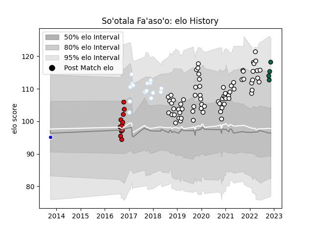

---  
layout: page  
title: So'otala Fa'aso'o  
date: 2023-03-11 00:14:36.197106  
categories: player  
---
# So'otala Fa'aso'o

## Positions: N8

## Current elo: 94.0

## Current Percentile: 41.0

# Elo History

# Match History

| Team             |   Appearances |   Win Rate |
|:-----------------|--------------:|-----------:|
| Brive            |            80 |   0.48125  |
| Racing 92        |            16 |   0.625    |
| Counties Manukau |            11 |   0.545455 |
| London Irish     |             6 |   0        |
| Auckland         |             2 |   0.5      |

| Opponent             |   Matches |   Win Rate |
|:---------------------|----------:|-----------:|
| Stade Francais Paris |         7 |   0.571429 |
| Clermont Auvergne    |         6 |   0.333333 |
| Bayonne              |         5 |   0.3      |
| Toulon               |         5 |   0.6      |
| Bordeaux Begles      |         5 |   0.6      |
| Agen                 |         4 |   0.75     |
| La Rochelle          |         4 |   0        |
| Montpellier Herault  |         4 |   0.375    |
| Pau                  |         4 |   0.75     |
| Castres Olympique    |         4 |   0.75     |
| Stade Toulousain     |         4 |   0.25     |
| Canterbury           |         3 |   0.666667 |
| Racing 92            |         3 |   0        |
| Biarritz Olympique   |         3 |   0.833333 |
| Leicester Tigers     |         3 |   0.333333 |
| Lyon                 |         3 |   0.333333 |
| Soyaux-Angouleme     |         2 |   1        |
| Mont-de-Marsan       |         2 |   0.5      |
| Provence Rugby       |         2 |   0.5      |
| Perpignan            |         2 |   0.5      |
| Oyonnax              |         2 |   1        |
| Munster              |         2 |   0        |
| US Bressane          |         2 |   0.5      |
| Wellington           |         2 |   0        |
| Montauban            |         2 |   0.5      |
| Massy                |         2 |   0.5      |
| Zebre                |         2 |   0.5      |
| Aurillac             |         2 |   0.5      |
| Grenoble             |         2 |   0.5      |
| Beziers              |         2 |   0.5      |
| Brive                |         2 |   1        |
| Carcassonne          |         1 |   0        |
| Waikato              |         1 |   1        |
| Vannes               |         1 |   1        |
| Bay of Plenty        |         1 |   1        |
| Tasman               |         1 |   0        |
| Taranaki             |         1 |   0        |
| Bristol Rugby        |         1 |   0        |
| Auckland             |         1 |   1        |
| Hawke's Bay          |         1 |   1        |
| Colomiers            |         1 |   1        |
| Edinburgh            |         1 |   0        |
| Exeter Chiefs        |         1 |   0        |
| Gloucester Rugby     |         1 |   0        |
| Otago                |         1 |   1        |
| North Harbour        |         1 |   0        |
| Nevers               |         1 |   1        |
| Harlequins           |         1 |   0        |
| Sale Sharks          |         1 |   0        |