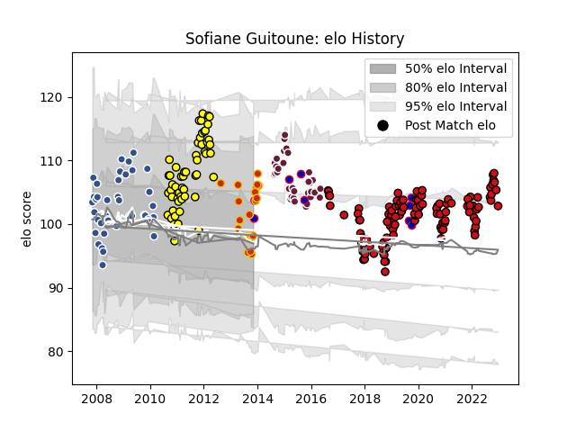

---  
layout: page  
title: Sofiane Guitoune  
date: 2023-01-06 00:15:10.476000  
categories: player  
---
# Sofiane Guitoune

## Positions: C, FB

## Country: France

## Current elo: 103.0

## Current Percentile: 26.0

# Elo History

# Match History

| Team             |   Appearances |   Win Rate |
|:-----------------|--------------:|-----------:|
| Stade Toulousain |           111 |   0.648649 |
| Albi             |            54 |   0.601852 |
| Agen             |            42 |   0.678571 |
| Bordeaux Begles  |            33 |   0.606061 |
| Perpignan        |            22 |   0.409091 |
| France           |             9 |   0.555556 |

| Opponent                 |   Matches |   Win Rate |
|:-------------------------|----------:|-----------:|
| Bordeaux Begles          |        16 |   0.8125   |
| Lyon                     |        15 |   0.533333 |
| Pau                      |        15 |   0.666667 |
| Grenoble                 |        15 |   0.733333 |
| Montpellier Herault      |        14 |   0.642857 |
| Stade Francais Paris     |        13 |   0.423077 |
| Racing 92                |        13 |   0.461538 |
| La Rochelle              |        12 |   0.666667 |
| Toulon                   |        10 |   0.55     |
| Clermont Auvergne        |         9 |   0.666667 |
| Castres Olympique        |         9 |   0.388889 |
| Tarbes                   |         8 |   0.75     |
| Oyonnax                  |         7 |   0.714286 |
| Narbonne                 |         7 |   0.428571 |
| Agen                     |         7 |   0.857143 |
| Aurillac                 |         7 |   0.642857 |
| Bayonne                  |         7 |   0.571429 |
| Brive                    |         7 |   0.571429 |
| Mont-de-Marsan           |         5 |   0.3      |
| Beziers                  |         5 |   0.6      |
| Perpignan                |         4 |   0.75     |
| Dax                      |         4 |   0.75     |
| Auch                     |         4 |   0.375    |
| Gloucester Rugby         |         4 |   0.5      |
| Stade Toulousain         |         4 |   0.75     |
| Provence Rugby           |         3 |   0.666667 |
| Colomiers                |         3 |   1        |
| Wasps                    |         3 |   0.666667 |
| Cardiff Blues            |         3 |   0.333333 |
| Leinster                 |         3 |   0.333333 |
| Carcassonne              |         3 |   0.666667 |
| Saint-Etienne            |         2 |   1        |
| Tonga                    |         2 |   1        |
| Exeter Chiefs            |         2 |   0        |
| Bath Rugby               |         2 |   1        |
| Limoges                  |         2 |   0.75     |
| Sale Sharks              |         2 |   0.75     |
| Périgueux                |         2 |   0.5      |
| Connacht                 |         2 |   1        |
| Biarritz Olympique       |         2 |   1        |
| Munster                  |         2 |   0        |
| Italy                    |         1 |   1        |
| Romania                  |         1 |   1        |
| Scotland                 |         1 |   0        |
| South Africa             |         1 |   0        |
| Ospreys                  |         1 |   1        |
| Bourgoin-Jallieu         |         1 |   1        |
| England                  |         1 |   0        |
| US Bressane              |         1 |   1        |
| Ulster                   |         1 |   1        |
| United States of America |         1 |   1        |
| Wales                    |         1 |   0        |
| Albi                     |         1 |   0        |