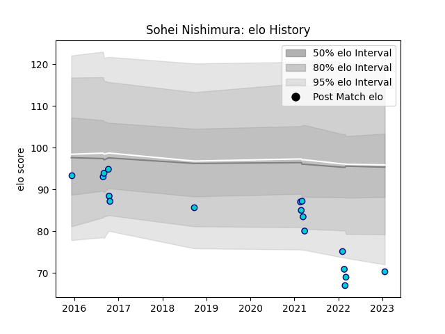

---  
layout: page  
title: Sohei Nishimura  
date: 2023-01-25 19:00:13.935629  
categories: player  
---
# Sohei Nishimura

## Positions: P

## Current elo: 70.0

## Current Percentile: 2.0

# Elo History

# Match History

| Team               |   Appearances |   Win Rate |
|:-------------------|--------------:|-----------:|
| Shizuoka Blue Revs |            17 |   0.558824 |

| Opponent                          |   Matches |   Win Rate |
|:----------------------------------|----------:|-----------:|
| Yokohama Canon Eagles             |         3 |   0.333333 |
| Green Rockets Tokatsu             |         2 |   1        |
| Kubota Spears Funabashi Tokyo-Bay |         2 |   0.5      |
| Saitama Wild Knights              |         2 |   0.5      |
| Black Rams Tokyo                  |         1 |   0        |
| Coca-Cola Red Sparks              |         1 |   1        |
| Hino Red Dolphins                 |         1 |   1        |
| Kobelco Kobe Steelers             |         1 |   0        |
| Mie Honda Heat                    |         1 |   1        |
| Mitsubishi Dynaboars              |         1 |   0.5      |
| Toshiba Brave Lupus Tokyo         |         1 |   0        |
| Urayasu D-Rocks                   |         1 |   1        |