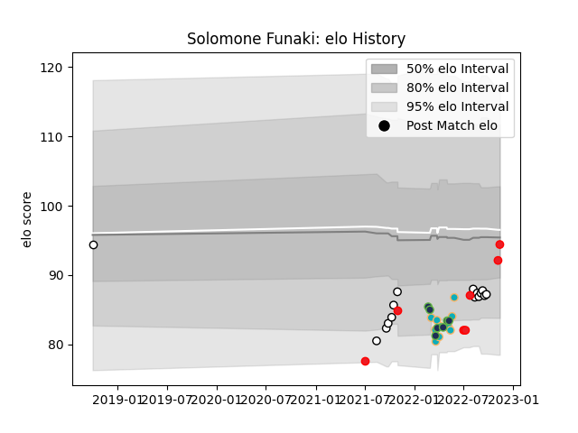

---  
layout: page  
title: Solomone Funaki  
date: 2023-03-21 18:54:31.608862  
categories: player  
---
# Solomone Funaki

Last updated: 2023-03-21
## Positions: FL, L

## Country: Tonga

## Current elo: 92.0

## Current Percentile: 41.0

# Elo History

# Match History

| Team              |   Appearances |   Win Rate |
|:------------------|--------------:|-----------:|
| Hawke's Bay       |            15 |   0.7      |
| Moana Pasifika    |            15 |   0.133333 |
| Seattle Seawolves |             9 |   0.444444 |
| Tonga             |             8 |   0.5      |

| Opponent                 |   Matches |   Win Rate |
|:-------------------------|----------:|-----------:|
| Canterbury               |         3 |   0.333333 |
| Chiefs                   |         3 |   0        |
| Austin Gilgronis         |         2 |   0        |
| San Diego Legion         |         2 |   1        |
| Wellington               |         2 |   0.5      |
| Brumbies                 |         2 |   0.5      |
| Bay of Plenty            |         2 |   0.5      |
| Dallas Jackals           |         2 |   1        |
| Manawatu                 |         2 |   1        |
| Fijian Drua              |         2 |   0        |
| R.U. New York            |         1 |   0        |
| Rugby New York           |         1 |   0        |
| Samoa                    |         1 |   0        |
| Spain                    |         1 |   1        |
| Scotland                 |         1 |   0        |
| Southland                |         1 |   1        |
| Otago                    |         1 |   1        |
| Tasman                   |         1 |   1        |
| Uruguay                  |         1 |   1        |
| Waikato                  |         1 |   0.5      |
| Queensland Reds          |         1 |   0        |
| Melbourne Rebels         |         1 |   0        |
| North Harbour            |         1 |   1        |
| New Zealand              |         1 |   0        |
| New South Wales Waratahs |         1 |   0        |
| L. A. Giltinis           |         1 |   0        |
| Hurricanes               |         1 |   1        |
| Hong Kong                |         1 |   1        |
| Highlanders              |         1 |   0        |
| Fiji                     |         1 |   0        |
| Crusaders                |         1 |   0        |
| Counties Manukau         |         1 |   1        |
| Chile                    |         1 |   1        |
| Blues                    |         1 |   0        |
| Western Force            |         1 |   0        |