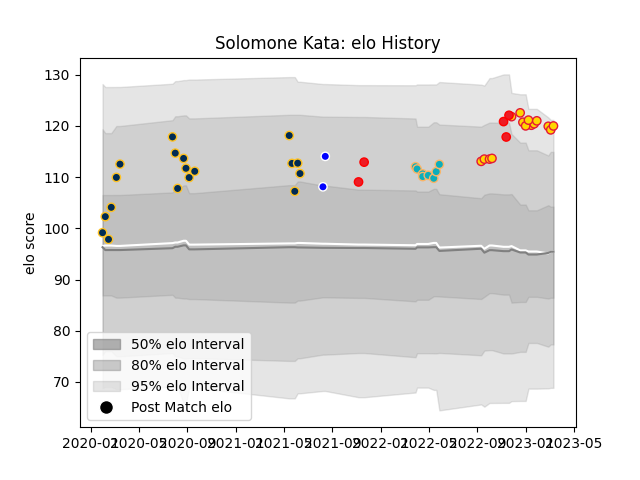

---  
layout: page  
title: Solomone Kata  
date: 2022-11-16 11:27:45.536151  
categories: player  
---
# Solomone Kata

## Positions: W, C

## Country: Tonga

## Current elo: 101.0

## Current Percentile: 65.0

# Elo History

# Match History

| Team           |   Appearances |   Win Rate |
|:---------------|--------------:|-----------:|
| Brumbies       |            18 |   0.611111 |
| Moana Pasifika |             8 |   0.125    |
| Exeter Chiefs  |             4 |   0.75     |
| Tonga          |             4 |   0.5      |
| Auckland       |             2 |   0.5      |

| Opponent                 |   Matches |   Win Rate |
|:-------------------------|----------:|-----------:|
| Queensland Reds          |         5 |   0.6      |
| Chiefs                   |         4 |   0.25     |
| Blues                    |         3 |   0        |
| Melbourne Rebels         |         3 |   0.333333 |
| Western Force            |         2 |   1        |
| Highlanders              |         2 |   0        |
| New South Wales Waratahs |         2 |   1        |
| Tasman                   |         1 |   0        |
| Sunwolves                |         1 |   1        |
| Spain                    |         1 |   1        |
| Sale Sharks              |         1 |   0        |
| Romania                  |         1 |   0        |
| Leicester Tigers         |         1 |   1        |
| Bristol Rugby            |         1 |   1        |
| Hurricanes               |         1 |   1        |
| Fijian Drua              |         1 |   0        |
| England                  |         1 |   0        |
| Crusaders                |         1 |   0        |
| Chile                    |         1 |   1        |
| Canterbury               |         1 |   1        |
| Brumbies                 |         1 |   1        |
| Worcester Warriors       |         1 |   1        |