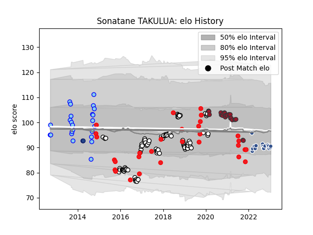

---  
layout: page  
title: Sonatane TAKULUA  
date: 2023-01-21 15:44:23.073143  
categories: player  
---
# Sonatane TAKULUA

## Positions: SH

## Country: Tonga

## Current elo: 91.0

## Current Percentile: 32.0

# Elo History

# Match History

| Team              |   Appearances |   Win Rate |
|:------------------|--------------:|-----------:|
| Newcastle Falcons |            95 |   0.484211 |
| Tonga             |            30 |   0.3      |
| Toulon            |            26 |   0.5      |
| Northland         |            24 |   0.354167 |
| Agen              |            17 |   0.470588 |
| Blues             |             2 |   0.5      |

| Opponent                 |   Matches |   Win Rate |
|:-------------------------|----------:|-----------:|
| Exeter Chiefs            |         9 |   0.111111 |
| Leicester Tigers         |         9 |   0.333333 |
| Sale Sharks              |         7 |   0.571429 |
| Wasps                    |         7 |   0.142857 |
| Harlequins               |         7 |   0.571429 |
| Saracens                 |         7 |   0        |
| Gloucester Rugby         |         7 |   0.571429 |
| Bath Rugby               |         7 |   0.428571 |
| Worcester Warriors       |         6 |   0.666667 |
| Northampton Saints       |         5 |   0.8      |
| Georgia                  |         4 |   0.25     |
| Bristol Rugby            |         4 |   0.5      |
| Lyon                     |         3 |   0.666667 |
| Hawke's Bay              |         3 |   0.333333 |
| Southland                |         3 |   0.333333 |
| United States of America |         3 |   1        |
| London Irish             |         3 |   1        |
| Samoa                    |         3 |   0        |
| Montpellier Herault      |         3 |   0.666667 |
| New Zealand              |         3 |   0        |
| Manawatu                 |         2 |   0        |
| Grenoble                 |         2 |   0.5      |
| Romania                  |         2 |   0.5      |
| La Rochelle              |         2 |   0        |
| Scotland                 |         2 |   0        |
| Rouen                    |         2 |   1        |
| Nevers                   |         2 |   0.5      |
| Otago                    |         2 |   0.5      |
| Stade Francais Paris     |         2 |   0.5      |
| Pau                      |         2 |   1        |
| North Harbour            |         2 |   0.75     |
| Stade Toulousain         |         2 |   0.5      |
| Provence Rugby           |         2 |   0.5      |
| Fiji                     |         2 |   0.5      |
| Argentina                |         2 |   0        |
| Auckland                 |         2 |   0        |
| Aurillac                 |         2 |   0.5      |
| Bay of Plenty            |         2 |   1        |
| Bayonne                  |         2 |   0        |
| Bordeaux Begles          |         2 |   0.5      |
| Wellington               |         2 |   0.5      |
| Wales                    |         2 |   0        |
| Carcassonne              |         2 |   0.5      |
| Castres Olympique        |         2 |   0.5      |
| Clermont Auvergne        |         2 |   0.5      |
| Connacht                 |         2 |   0.5      |
| Toulon                   |         2 |   0.5      |
| Tasman                   |         2 |   0.5      |
| Taranaki                 |         2 |   0        |
| Edinburgh                |         2 |   0        |
| England                  |         2 |   0        |
| Waikato                  |         1 |   0        |
| Vannes                   |         1 |   1        |
| Scarlets                 |         1 |   1        |
| Spain                    |         1 |   1        |
| Racing 92                |         1 |   1        |
| Agen                     |         1 |   1        |
| Perpignan                |         1 |   0        |
| Ealing Trailfinders      |         1 |   1        |
| Beziers                  |         1 |   0        |
| Brive                    |         1 |   0        |
| Brumbies                 |         1 |   0        |
| Canterbury               |         1 |   0        |
| Colomiers                |         1 |   0        |
| Cornish Pirates          |         1 |   1        |
| Coventry                 |         1 |   1        |
| Doncaster                |         1 |   1        |
| Dragons                  |         1 |   1        |
| France                   |         1 |   0        |
| Nottingham               |         1 |   1        |
| Hartpury College         |         1 |   1        |
| Highlanders              |         1 |   1        |
| Italy                    |         1 |   1        |
| Japan                    |         1 |   0        |
| Ampthill                 |         1 |   1        |
| Massy                    |         1 |   1        |
| Mont-de-Marsan           |         1 |   0        |
| Montauban                |         1 |   0        |
| Namibia                  |         1 |   1        |
| Yorkshire Carnegie       |         1 |   1        |