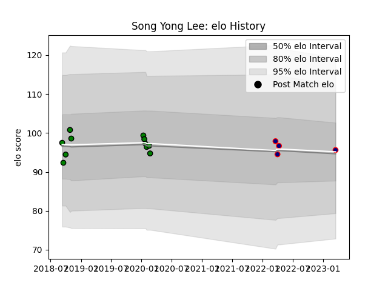

---  
layout: page  
title: Song Yong Lee  
date: 2023-03-21 18:20:10.092802  
categories: player  
---
# Song Yong Lee

Last updated: 2023-03-21
## Positions: P

## Current elo: 96.0

## Current Percentile: 48.0

# Elo History

# Match History

| Team                     |   Appearances |   Win Rate |
|:-------------------------|--------------:|-----------:|
| Mitsubishi Dynaboars     |            11 |   0.454545 |
| Hanazono Kintetsu Liners |             4 |   0.75     |

| Opponent                        |   Matches |   Win Rate |
|:--------------------------------|----------:|-----------:|
| Kamaishi Seawaves               |         2 |          1 |
| NTT Docomo Red Hurricanes Osaka |         2 |          0 |
| Chugoku Red Regulions           |         1 |          1 |
| Green Rockets Tokatsu           |         1 |          1 |
| Hino Red Dolphins               |         1 |          1 |
| Kurita Water Gush               |         1 |          1 |
| Kyuden Voltex                   |         1 |          1 |
| Mie Honda Heat                  |         1 |          1 |
| Saitama Wild Knights            |         1 |          0 |
| Shizuoka Blue Revs              |         1 |          0 |
| Tokyo Sungoliath                |         1 |          0 |
| Toshiba Brave Lupus Tokyo       |         1 |          0 |
| Yokohama Canon Eagles           |         1 |          0 |