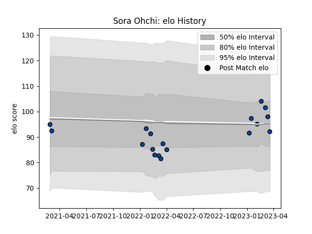

---  
layout: page  
title: Sora Ohchi  
date: 2023-03-21 18:45:00.617697  
categories: player  
---
# Sora Ohchi

Last updated: 2023-03-21
## Positions: C, W

## Current elo: 92.0

## Current Percentile: 55.0

# Elo History

# Match History

| Team                |   Appearances |   Win Rate |
|:--------------------|--------------:|-----------:|
| Skyactivs Hiroshima |            18 |   0.222222 |

| Opponent                        |   Matches |   Win Rate |
|:--------------------------------|----------:|-----------:|
| NTT Docomo Red Hurricanes Osaka |         3 |        0   |
| Chugoku Red Regulions           |         2 |        1   |
| Hanazono Kintetsu Liners        |         2 |        0   |
| Kamaishi Seawaves               |         2 |        0.5 |
| Kurita Water Gush               |         2 |        0.5 |
| Kyuden Voltex                   |         2 |        0   |
| Mie Honda Heat                  |         2 |        0   |
| Mitsubishi Dynaboars            |         2 |        0   |
| Hino Red Dolphins               |         1 |        0   |