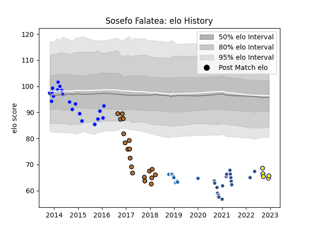

---  
layout: page  
title: Sosefo Falatea  
date: 2022-12-14 11:29:22.781581  
categories: player  
---
# Sosefo Falatea

## Positions: P

## Current elo: 65.0

## Current Percentile: 0.0

# Elo History

# Match History

| Team              |   Appearances |   Win Rate |
|:------------------|--------------:|-----------:|
| Colomiers         |            20 |   0.225    |
| Narbonne          |            19 |   0.368421 |
| Agen              |            18 |   0        |
| Castres Olympique |            10 |   0.5      |
| Nevers            |             4 |   0.375    |

| Opponent             |   Matches |   Win Rate |
|:---------------------|----------:|-----------:|
| Perpignan            |         6 |   0.25     |
| Pau                  |         6 |   0.166667 |
| Agen                 |         5 |   0.2      |
| Biarritz Olympique   |         4 |   0.375    |
| La Rochelle          |         4 |   0        |
| Dax                  |         3 |   0.666667 |
| Bordeaux Begles      |         3 |   0        |
| Aurillac             |         3 |   0.333333 |
| Racing 92            |         2 |   0.5      |
| Soyaux-Angouleme     |         2 |   0.5      |
| Mont-de-Marsan       |         2 |   0        |
| Lyon                 |         2 |   0        |
| Beziers              |         2 |   0.5      |
| Gloucester Rugby     |         2 |   0.5      |
| Bayonne              |         2 |   0        |
| Colomiers            |         2 |   0        |
| Clermont Auvergne    |         2 |   0.5      |
| Castres Olympique    |         2 |   0        |
| Carcassonne          |         2 |   0.5      |
| US Bressane          |         2 |   1        |
| Toulon               |         2 |   0        |
| Tarbes               |         1 |   0        |
| Stade Francais Paris |         1 |   0        |
| Massy                |         1 |   1        |
| Oyonnax              |         1 |   0        |
| Nevers               |         1 |   0        |
| Narbonne             |         1 |   1        |
| Montpellier Herault  |         1 |   0        |
| Montauban            |         1 |   0        |
| Grenoble             |         1 |   0        |
| Bourgoin-Jallieu     |         1 |   0        |
| Vannes               |         1 |   0        |